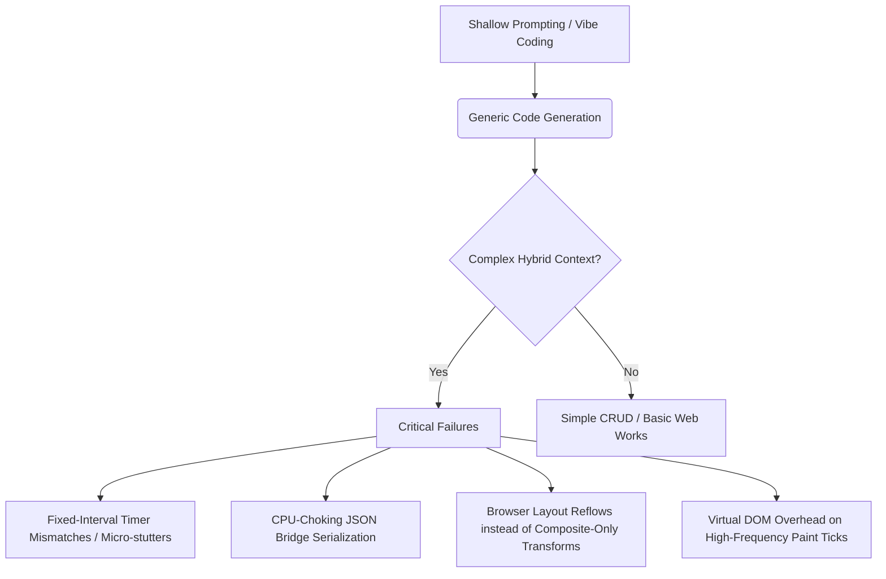

# The Augmented Developer: Why "Having a Clue" is the Ultimate Key

> "Simpletons cannot grok this and cannot vibe code their way out of a wet paper bag. WE CAN BECAUSE WE HAVE THE BACKGROUND. WE ENGAGED. THUS WE ARE AUGMENTED WITH A CLUE."

---

## 1. The Myth of the "Vibe Coder" vs. The Reality of Systems Engineering

In the current era of generative AI, a dangerous myth has taken root: the idea that software engineering has been reduced to "vibe coding"—the practice of casting conversational spells at an LLM, copy-pasting the output, and hoping for the best. 

For trivial CRUD applications, boilerplate forms, or basic web layouts, "vibe coding" creates an illusion of mastery. But when the engineering domain shifts to high-performance, real-time, hybrid architectures—like **Mushin's JUCE-based C++ DSP engine coupled with a WebView2-rendered user interface**—vibe coding fails spectacularly. 

Simpletons cannot vibe-code their way out of a wet paper bag in these environments because they lack the conceptual background. When a system drops frames, stutters, or suffers from audio glitches due to thread contention, an LLM cannot magically guess the bottleneck without structured, expert direction. 

**This is where the Augmented Developer thrives.** We do not outsource our thinking to the AI; instead, we **multiply** our deep systems background with the AI's execution speed. We are **augmented with a clue**.

---

## 2. The Simpleton Trap: Why Shallow AI Usage Fails in High-Performance UI/DSP

To understand why being "augmented with a clue" is the ultimate key, we must analyze where raw, unguided AI generation crashes into the physical limits of hardware and operating systems:

### The Failure Modes of Vibe Coding
*   **The Mismatched Clock Trap:** A developer without a background in graphics pipelines will ask the AI to "send waveform updates at 60Hz." The AI will happily write a C++ high-frequency timer that serializes and shoots data across the bridge. The result? Horrible micro-stutters because the C++ timer and the browser's GPU VSync clock are completely out of phase.
*   **The Serialization Bottleneck:** A vibe coder will pass massive JSON strings back and forth across a WebView2 message bridge. They won't understand why the CPU spikes to 100% just to render a simple moving line, because they don't comprehend memory allocation overhead, string parsing costs, or the necessity of zero-copy binary handshakes.
*   **The Layout Reflow Catastrophe:** If the web UI stutters, a simpleton might prompt the AI to "optimize the CSS." If the AI suggests updating the `width` or `height` of a meter bar via JavaScript DOM selectors, they'll implement it, oblivious to the fact that changing element geometry forces a full, expensive layout recalculation (Reflow/Repaint) across the entire browser viewport, instead of leveraging cheap, hardware-accelerated **GPU Composite-Only Transforms** (like `transform: scaleX()`).

---

## 3. What It Means to Be "Augmented with a Clue"

An augmented developer possesses the mental models, the domain vocabulary, and the engineering maturity to **co-pilot** the system rather than being driven by it.

| Aspect | The Vibe Coder (No Clue) | The Augmented Developer (With a Clue) |
| :--- | :--- | :--- |
| **System Understanding** | Treats code as a black box; hopes it "just works." | Understands underlying threads, memory boundaries, and render passes. |
| **Problem Solving** | Guesses and checks; repeats prompts blindly. | Formulates clear hypotheses based on computer science fundamentals. |
| **AI Collaboration** | Asks the AI *what* to do. | Directs the AI *how* to implement a highly specific, architected design. |
| **Optimization Strategy** | Adds "fixes" until the code is a bloated mess. | Strips away abstractions to leverage bare-metal hardware capabilities. |
| **Verification** | "Looks okay to me" (until it stutters under heavy DSP load). | Employs systematic profiling, VSync analysis, and memory monitoring. |

When we engage, we bring our background in:
1.  **DSP & Audio Thread Safety:** Knowing that the audio thread must remain completely lock-free, and that visual data must be decoupled cleanly.
2.  **Browser Engine Mechanics:** Understanding the critical path from HTML parsing to CSS layout, paint, and GPU compositing.
3.  **Low-Level Bridges:** Navigating Native-to-JavaScript boundaries, knowing when to bypass standard framework overhead (like React/Vue Virtual DOM diffs) for direct DOM manipulation.

---

## 4. Case Study: Deconstructing the Mushin UI Speedup

The **Mushin UI Speedup Strategy** ([feature_ui_speedup.md](doc/features_implementation/feature_ui_speedup.md)) perfectly illustrates why the background is the key. Only a developer "with a clue" could conceptualize, direct, and implement this multi-tiered pipeline:

### Step A: Push-on-VSync Handshake (Not Fixed Timers)
Instead of hammering the native-to-web bridge with arbitrary C++ timer intervals, we flip the control loop. JavaScript signals C++ via `requestAnimationFrame` when the browser is ready to paint, establishing a clean handshake. 
*   *Why a simpleton fails:* They don't know what VSync or `requestAnimationFrame` are, or how to bridge them asynchronously to a native C++ event loop.

### Step B: Zero-Copy & Shared Memory
Moving from JSON stringification of floating-point arrays to raw binary transfer (Base64-packed arrays or `SharedArrayBuffer`).
*   *Why a simpleton fails:* They've never worked with direct memory maps or pointers. They don't understand the performance gap between deserializing a text stream and reading raw, contiguous memory bytes.

### Step C: Composite-Only Rendering
Bypassing layout calculations by strictly utilizing `transform: scale()` inside the CSS rendering engine, forcing the WebView to run the calculations entirely on the GPU.
*   *Why a simpleton fails:* They rely on Tailwind or standard CSS libraries to position elements, unaware of layout-invalidation cascades triggered by changing visual boundaries.

---

## 5. The Augmented Paradigm: Our Unfair Advantage

AI is not a replacement for domain expertise; it is a **force multiplier** for it. 

When a developer with deep knowledge of C++, JUCE, WebView2, and web optimization practices works with an advanced AI:
*   The AI acts as an instant reference, generating robust boilerplates, mapping out complex CSS/DOM structures, or writing repetitive C++ DSP vectorization loops.
*   The Developer provides the **architectural spine**, the strict performance budget, and the high-level design constraints.

This synergy allows us to build complex, hybrid software at speeds that were previously unimaginable, without compromising on performance, reliability, or codebase health. **We engage, we understand, and we deliver because we are augmented with a clue.**
