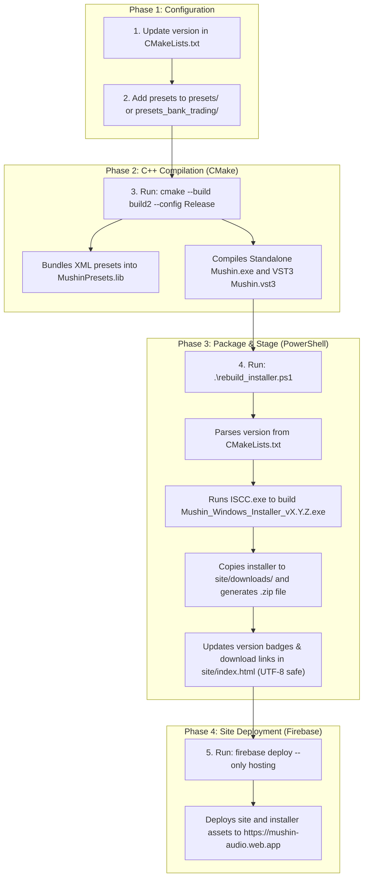

# Mushin Build and Publish Procedure

This document provides a step-by-step guide for compiling the Mushin Audio Synthesizer, packaging its binaries and presets, updating the website assets, and deploying it to the production server.

---

## Process Overview

The build and publication pipeline consists of code compilation, installer packaging, website asset generation, and deployment:



---

## Detailed Step-by-Step Procedure

### Step 1: Update Version & Presets
*   **Action:** 
    1. Open [CMakeLists.txt](../CMakeLists.txt) and modify the project version in the `project` declaration:
        ```cmake
        project(Mushin VERSION 1.0.1)
        ```
    2. Add or modify preset XML files inside the [presets/](../presets) or [presets_bank_trading/](../presets_bank_trading) folders.
*   **Outcome:** 
    - The new version number is set globally.
    - Added presets will be scanned and bundled during the next C++ compilation.

---

### Step 2: Compile the C++ Binaries
*   **Action:** Open a PowerShell console in the repository root and run:
    ```powershell
    cmake --build build2 --config Release
    ```
*   **Outcome:**
    - CMake globs the XML presets and compiles them into a static binary library (`MushinPresets.lib`) under the namespace `MushinPresetsData`.
    - Compiles the shared JUCE engine code.
    - Generates the standalone executable `build2\Mushin_artefacts\Release\Standalone\Mushin.exe`.
    - Generates the VST3 plugin bundle `build2\Mushin_artefacts\Release\VST3\Mushin.vst3\Contents\x86_64-win\Mushin.vst3`.

---

### Step 3: Run the Packager and Staging Script
*   **Action:** From the repository root, run the custom automation script:
    ```powershell
    powershell -ExecutionPolicy Bypass -File .\rebuild_installer.ps1
    ```
*   **Outcome:**
    1. **Version Parsing:** Parses the version number dynamically from [CMakeLists.txt](../CMakeLists.txt).
    2. **Installer Compilation:** Invokes the Inno Setup Compiler (`ISCC.exe`) passing the version macro (`/DAppVersion=X.Y.Z`). This bundles the standalone executable, VST3 plugin, and WebView2 DLL files into a single installer named `Mushin_Windows_Installer_vX.Y.Z.exe` in `build2\installer\`.
    3. **Asset Staging:** Copies the installer to `site\downloads\Mushin_Windows_Installer_vX.Y.Z.exe`.
    4. **Archive Generation:** Compresses the `.exe` into a ZIP archive named `Mushin_Windows_Installer_vX.Y.Z.zip` inside `site\downloads\`.
    5. **Site Updating:** Reads [site/index.html](../site/index.html) using .NET UTF-8 file utilities (avoiding PowerShell emoji corruption bugs) and replaces the version badges and download ZIP link references to point to the new version.

---

### Step 4: Publish to Production
*   **Action:** Run the Firebase deployment command:
    ```powershell
    firebase deploy --only hosting
    ```
*   **Outcome:**
    - Uploads the updated [site/index.html](../site/index.html) and staged installer assets in `site/downloads/` to Firebase Hosting.
    - The website is live at [https://mushin-audio.web.app](https://mushin-audio.web.app). Emojis are preserved, and download buttons fetch the newly compiled installer ZIP containing the latest default and trading presets.
