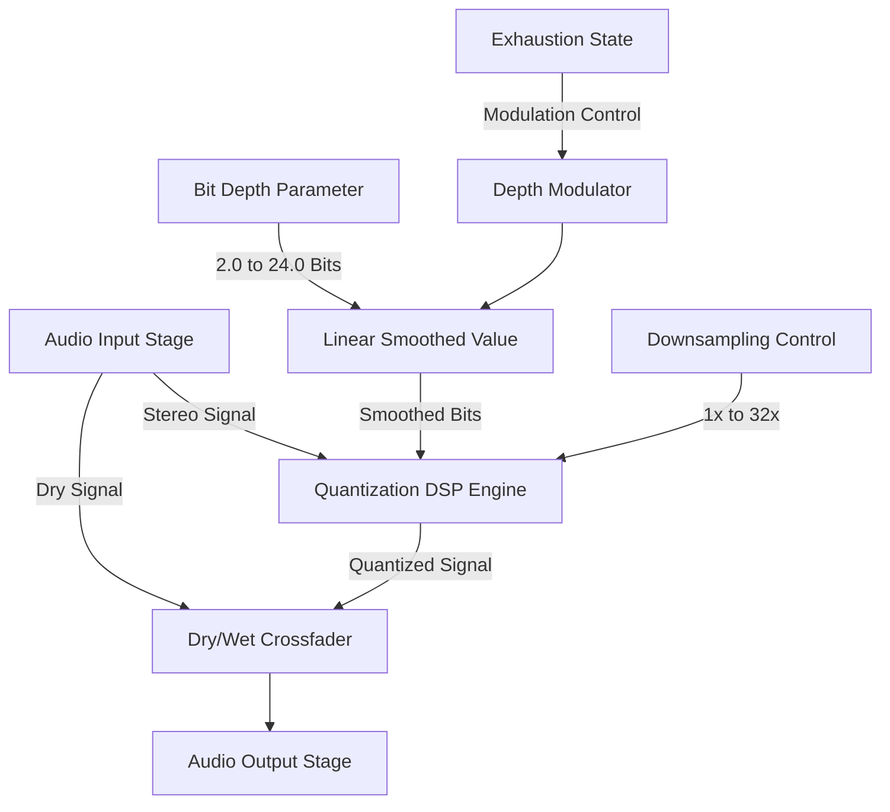

**4. Quantization Error (Information Decay)**
If exhaustion is the degradation of signal integrity, bitcrushing is the purest DSP representation of a fading signal.
* **The Math:** Audio quantization reduces the number of possible amplitude values. The formula is $y = \frac{\text{round}(x \cdot \text{steps})}{\text{steps}}$, where `steps` dictates the bit depth (e.g., $2^{16}$ for 16-bit).
* **The Logic:** Tie the `steps` variable to the statistical confidence of the move. As the "last buyer" enters and statistical capacity drains, dynamically reduce the `steps` from $2^{24}$ down to $2^8$ or $2^4$.
* **The Exhaustion Event:** The audio doesn't just get quieter; it gets fundamentally destroyed by quantization noise. The signal breaks apart under its own weight, exactly how a trend fractures at the top of a run.

---

# Technical Implementation Specification: Quantization Error & Information Decay

**Location:** `doc/features/feature_quantizatiion_error.md`  
**Status:** Design Phase (Ready for Implementation)  
**Date:** May 2026

---

## 1. Overview & Conceptual Architecture

The **Quantization Error (Information Decay)** module simulates the degradation and "pixelation" of audio data as statistical confidence in a financial trend collapses. In Mushin's narrative, high confidence corresponds to ultra-high 24-bit resolution, while the onset of exhaustion rapidly decimates the signal resolution down to low-fidelity 4-bit or 2-bit formats.

Unlike simple linear bitcrushers, this implementation features **continuous bit-depth modulation** with sample-rate downsampling, dynamic smoothing to prevent mechanical switching clicks, and direct integration with the global **Exhaustion** state.



---

## 2. DSP Engine Architecture

To achieve premium audio fidelity without standard digital aliasing clicking, the quantization engine utilizes double-precision float operations with continuous resolution curves.

The processor is implemented as a dedicated DSP utility: `Source/dsp/QuantizationErrorProcessor.h`.

### 2.1 The Mathematical Formulation

For a bipolar floating-point sample $x \in [-1.0, 1.0]$ and a continuous bit-depth $B \in [2.0, 24.0]$:

1. **Continuous Step Scale** ($S$):
   $$S = 2^{B - 1}$$
   *At $B = 24$, $S = 8,388,608$ (virtual 24-bit quantization).*  
   *At $B = 4$, $S = 8$ (coarse 16-level quantization).*

2. **Quantization Formula**:
   $$y = \frac{\text{std::round}(x \cdot S)}{S}$$

3. **Temporal Downsampling (Sample-Rate Reduction)**:
   In addition to amplitude quantization, temporal resolution decay (downsampling) can be applied. For a downsampling factor $D \in [1, 32]$:
   - A sample counter track $c$ advances with each processed sample.
   - The output sample is updated only when $c \pmod D == 0$; otherwise, the processor holds and outputs the previous sample.

### 2.2 C++ Processor Declaration (`QuantizationErrorProcessor.h`)

Below is the complete C++ DSP header designed for Mushin's high-performance audio path:

```cpp
#pragma once

#include <juce_audio_utils/juce_audio_utils.h>
#include <cmath>
#include <algorithm>

namespace mushin {

class QuantizationErrorProcessor
{
public:
    QuantizationErrorProcessor() = default;
    ~QuantizationErrorProcessor() = default;

    void prepare(double sampleRate)
    {
        currentSampleRate = sampleRate;
        reset();
    }

    void reset()
    {
        for (int ch = 0; ch < 2; ++ch)
        {
            heldSample[ch] = 0.0f;
            sampleCounter[ch] = 0;
        }
    }

    /**
     * Processes a single audio sample.
     * @param channel The channel index (0 for Left, 1 for Right).
     * @param sample The input floating point sample.
     * @param bitDepth The target resolution bit depth (continuous, 2.0 to 24.0).
     * @param downsample The downsample factor (1 to 32).
     * @param mix The dry/wet mix of this effect (0.0 to 1.0).
     */
    float processSample(int channel, float sample, float bitDepth, int downsample, float mix) noexcept
    {
        if (mix <= 0.001f)
            return sample;

        float wetSample = sample;

        // --- 1. Time-Domain Resolution Decay (Downsampling) ---
        if (downsample > 1)
        {
            if (sampleCounter[channel] % downsample == 0)
            {
                heldSample[channel] = wetSample;
            }
            wetSample = heldSample[channel];
            sampleCounter[channel]++;
        }
        else
        {
            sampleCounter[channel] = 0;
        }

        // --- 2. Amplitude-Domain Resolution Decay (Quantization) ---
        if (bitDepth < 23.9f)
        {
            // Calculate step scale based on the continuous bit depth
            // We use std::max to enforce a safe minimum of 2.0 bits (prevents division by zero)
            float safeDepth = std::max(2.0f, bitDepth);
            float steps = std::pow(2.0f, safeDepth - 1.0f);

            // Bipolar mid-tread quantization
            wetSample = std::round(wetSample * steps) / steps;
        }

        // --- 3. Dry/Wet Crossfade ---
        return (1.0f - mix) * sample + mix * wetSample;
    }

private:
    double currentSampleRate = 44100.0;
    float heldSample[2] = { 0.0f, 0.0f };
    uint32_t sampleCounter[2] = { 0, 0 };
};

} // namespace mushin
```

---

## 3. APVTS & Host Integration

To integrate this module into `MushinAudioProcessor`, we must register new parameters and stitch the DSP processor into the unified processing loop.

### 3.1 Parameters (APVTS)
We add four parameters under `createParameterLayout()` in `Source/PluginProcessor.cpp`:

| Parameter ID | Name | Type | Range / Options | Default | Description |
| :--- | :--- | :--- | :--- | :--- | :--- |
| `qe_active` | Info Decay Active | Bool | [Off, On] | Off | Master bypass switch for the effect |
| `qe_depth` | Decayed Resolution | Float | `2.0f` to `24.0f` bits | `24.0f` bits | Target resolution depth (amplitude domain) |
| `qe_downsample` | Time Resolution | Float | `1.0f` to `32.0f` (integers) | `1.0f` *(No decimation)* | Downsampling factor (time domain) |
| `qe_mix` | Decay Mix | Float | `0.0f` to `1.0f` | `1.0f` *(100% Wet)* | Dry/Wet crossfade factor |
| `qe_link` | Exhaustion Link | Bool | [Off, On] | Off | Link resolution directly to the exhaustion switch |

### 3.2 Member Variables & Header Additions (`PluginProcessor.h`)
We declare the processor and smooth parameters inside the private section of `MushinAudioProcessor`:

```cpp
#include "dsp/QuantizationErrorProcessor.h"

// ... inside MushinAudioProcessor ...
private:
    mushin::QuantizationErrorProcessor quantizationError;
    
    // Smoothed values to prevent step clicks during modulation
    juce::LinearSmoothedValue<float> smoothedQeDepth;
    juce::LinearSmoothedValue<float> smoothedQeMix;

    // Parameter pointers
    std::atomic<float>* qeActiveParam = nullptr;
    std::atomic<float>* qeDepthParam = nullptr;
    std::atomic<float>* qeDownsampleParam = nullptr;
    std::atomic<float>* qeMixParam = nullptr;
    std::atomic<float>* qeLinkParam = nullptr;
```

<h3>3.3 Audio Processing Integration (<code>PluginProcessor.cpp</code>)</h3>

1. **Parameter Initialization (`MushinAudioProcessor()`)**:
   ```cpp
   qeActiveParam     = treeState.getRawParameterValue ("qe_active");
   qeDepthParam      = treeState.getRawParameterValue ("qe_depth");
   qeDownsampleParam = treeState.getRawParameterValue ("qe_downsample");
   qeMixParam        = treeState.getRawParameterValue ("qe_mix");
   qeLinkParam       = treeState.getRawParameterValue ("qe_link");
   ```

2. **Prepare to Play (`prepareToPlay()`)**:
   ```cpp
   quantizationError.prepare(sampleRate);
   smoothedQeDepth.reset(sampleRate, 0.05); // 50ms smoothing ramp
   smoothedQeMix.reset(sampleRate, 0.05);
   ```

3. **Reset State (`reset()`)**:
   ```cpp
   quantizationError.reset();
   ```

4. **Modulation and Processing (`processBlock()`)**:
   Insert the stage at **STAGE A.5** (right after the main hard/soft clipping waveshaper and before the dual filtering section). This ensures that saturated signals get quantized, resulting in the classic gritty digital bite.

   ```cpp
   // Inside processBlock: Update parameters
   bool qeActive = (qeActiveParam->load() > 0.5f);
   float targetQeDepth = qeDepthParam->load();
   
   // Check for Exhaustion linkage:
   // If link is ON and global exhaustion is toggled, pull depth down dynamically
   if (qeLinkParam->load() > 0.5f && exhaustionParam->load() > 0.5f) {
       targetQeDepth = 4.0f; // Rapid collapse to gritty 4-bit resolution
   }
   
   smoothedQeDepth.setTargetValue(targetQeDepth);
   smoothedQeMix.setTargetValue(qeMixParam->load());
   int downsampleFactor = static_cast<int>(qeDownsampleParam->load());

   // Inside the sample loop, apply the processor to each active channel:
   for (int ch = 0; ch < totalNumOutputChannels; ++ch)
   {
       // ... STAGE A: Distortion ...
       wetSample = waveshaper.processSample(ch, wetSample);

       // --- STAGE A.5: Quantization Error (Information Decay) ---
       if (qeActive) {
           float currentDepth = smoothedQeDepth.getNextValue();
           float currentMix = smoothedQeMix.getNextValue();
           wetSample = quantizationError.processSample(ch, wetSample, currentDepth, downsampleFactor, currentMix);
       }

       // ... STAGE B: Dual Filtering ...
       wetSample = dualFilterSystem.processSample(ch, wetSample, currentFmMod);
   }
   ```

---

## 4. Premium Glassmorphic Web UI Design

To match Mushin's high-fidelity sci-fi aesthetic, the Quantization Error UI is integrated as a premium dedicated module in Column 3, styled with custom vintage glass plates, brushed metal screws, and glowing neon status indicator rings.

### 4.1 UI Layout Structure (HTML)
Insert this component inside `Source/Web/index.html` at the top of Column 3 (or nested adjacent to the Saturation panel):

```html
<!-- INFO DECAY (QUANTIZATION ERROR) PANEL -->
<div class="sub-panel" id="panel-info-decay">
    <div style="display: flex; justify-content: space-between; align-items: center; margin-bottom: 6px;">
        <div class="sub-panel-title" style="border-bottom: none; margin-bottom: 0; font-size: 1.0rem; letter-spacing: 0.1em; color: var(--primary);">INFO DECAY</div>
        <div style="display: flex; gap: 6px; align-items: center;">
            <input type="checkbox" id="qe_active" style="display: none;">
            <label class="glow-switch-label" for="qe_active" id="qe_active_indicator" title="Toggle Info Decay">
                <span class="glow-switch-dot"></span>
            </label>
        </div>
    </div>

    <!-- Bit Depth LED Resolution Readout -->
    <div class="bit-readout-container">
        <div class="bit-readout-label">SYSTEM RESOLUTION</div>
        <div class="bit-readout-value" id="bit-readout-val">24.0 BIT</div>
    </div>

    <!-- Knobs & Grid Controls Row -->
    <div style="display: grid; grid-template-columns: 1fr 1fr; gap: 15px; margin-top: 10px; text-align: center; align-items: center;">
        
        <!-- Resolution Knob -->
        <div style="display: flex; flex-direction: column; align-items: center;">
            <div class="label" title="Amplitude Quantization (Bits)">Resolution</div>
            <div class="mushin-knob mushin-knob-small" id="knob-qe_depth" data-param="qe_depth" data-default="24.0" tabindex="0">
                <svg viewBox="0 0 100 100" class="knob-svg">
                    <circle class="knob-track-bg" cx="50" cy="50" r="44" />
                    <path class="knob-value-arc" d="" />
                    <circle class="knob-bezel" cx="50" cy="50" r="36" />
                    <circle class="knob-dome" cx="50" cy="50" r="26" fill="url(#metallic-dome)" />
                    <circle class="knob-reflection" cx="50" cy="50" r="26" fill="url(#brushed-reflection)" pointer-events="none" />
                    <g class="knob-pointer-group">
                        <line class="knob-pointer-line" x1="50" y1="50" x2="50" y2="16" />
                        <circle class="knob-pointer-dot" cx="50" cy="18" r="2.5" />
                    </g>
                </svg>
                <input type="range" id="qe_depth" min="2" max="24" step="0.1" style="display: none;">
            </div>
            <div class="value" id="qe_depth-val">24.0 Bits</div>
        </div>

        <!-- Downsampling Knob -->
        <div style="display: flex; flex-direction: column; align-items: center;">
            <div class="label" title="Temporal Downsampling (Rate decimation)">Downsample</div>
            <div class="mushin-knob mushin-knob-small" id="knob-qe_downsample" data-param="qe_downsample" data-default="1.0" tabindex="0">
                <svg viewBox="0 0 100 100" class="knob-svg">
                    <circle class="knob-track-bg" cx="50" cy="50" r="44" />
                    <path class="knob-value-arc" d="" />
                    <circle class="knob-bezel" cx="50" cy="50" r="36" />
                    <circle class="knob-dome" cx="50" cy="50" r="26" fill="url(#metallic-dome)" fill-opacity="1" />
                    <circle class="knob-reflection" cx="50" cy="50" r="26" fill="url(#brushed-reflection)" pointer-events="none" />
                    <g class="knob-pointer-group">
                        <line class="knob-pointer-line" x1="50" y1="50" x2="50" y2="16" />
                        <circle class="knob-pointer-dot" cx="50" cy="18" r="2.5" />
                    </g>
                </svg>
                <input type="range" id="qe_downsample" min="1" max="32" step="1" style="display: none;">
            </div>
            <div class="value" id="qe_downsample-val">1x (Clean)</div>
        </div>
    </div>

    <!-- Extra Settings Strip (Mix & Exhaustion Link) -->
    <div style="display: flex; justify-content: space-between; align-items: center; margin-top: 12px; padding: 4px 6px; background: rgba(0,0,0,0.2); border-radius: 4px; border: 1px solid var(--marking);">
        <div style="display: flex; align-items: center; gap: 4px;">
            <input type="checkbox" id="qe_link">
            <div class="label" style="font-size: 0.55rem;" title="Link bit depth directly to global exhaustion switch">Link Exhaust</div>
        </div>
        <div style="display: flex; align-items: center; gap: 6px;">
            <div class="label" style="font-size: 0.55rem;">Mix</div>
            <input type="range" id="qe_mix" min="0" max="1" step="0.01" style="width: 55px; height: 3px; background: #000; outline: none; border-radius: 2px;">
            <span class="value" id="qe_mix-val" style="font-size: 0.55rem; width: 25px; text-align: right;">100%</span>
        </div>
    </div>
</div>
```

### 4.2 Styling & Theming (CSS)
Inject these styles to style the digital warning displays and indicators in `index.html`:

```css
/* Custom Glow Switch Indicator */
.glow-switch-label {
    display: block;
    width: 22px;
    height: 12px;
    background: #0c0c0c;
    border: 1px solid var(--panel-border);
    border-radius: 6px;
    position: relative;
    cursor: pointer;
    box-shadow: inset 0 1px 3px rgba(0,0,0,0.8);
    transition: all 0.2s ease;
}

.glow-switch-dot {
    position: absolute;
    width: 8px;
    height: 8px;
    background: #444;
    border-radius: 50%;
    top: 1px;
    left: 1px;
    transition: all 0.2s cubic-bezier(0.34, 1.56, 0.64, 1);
    box-shadow: inset 0 0.5px 1px rgba(255,255,255,0.4);
}

/* Checked state transitions */
#qe_active:checked + .glow-switch-label {
    border-color: var(--primary);
    background: rgba(0, 210, 255, 0.05);
}

#qe_active:checked + .glow-switch-label .glow-switch-dot {
    left: 11px;
    background: var(--primary);
    box-shadow: 0 0 6px var(--primary), inset 0 1px 1px rgba(255,255,255,0.8);
}

/* System Resolution LED panel styling */
.bit-readout-container {
    background: radial-gradient(circle at center, #110202 0%, #050000 100%);
    border: 1px solid #3a0e0e;
    border-radius: 4px;
    padding: 4px 10px;
    margin-top: 6px;
    text-align: center;
    box-shadow: inset 0 2px 5px rgba(0, 0, 0, 0.95);
    transition: all 0.3s ease;
}

.bit-readout-label {
    font-family: inherit;
    font-size: 0.45rem;
    color: #8f3434;
    letter-spacing: 2px;
}

.bit-readout-value {
    font-family: 'Courier New', Courier, monospace;
    font-size: 1.1rem;
    font-weight: bold;
    color: #ff3333;
    text-shadow: 0 0 8px rgba(255, 51, 51, 0.8), 0 0 20px rgba(255, 51, 51, 0.4);
    letter-spacing: 1px;
    transition: all 0.3s ease;
}

/* High Fidelity mode (when active but resolution is full) */
.sub-panel:has(#qe_active:not(:checked)) .bit-readout-container {
    background: radial-gradient(circle at center, #02110b 0%, #000502 100%);
    border-color: #0e3a1f;
}

.sub-panel:has(#qe_active:not(:checked)) .bit-readout-label {
    color: #348f58;
}

.sub-panel:has(#qe_active:not(:checked)) .bit-readout-value {
    color: #33ff77;
    text-shadow: 0 0 8px rgba(51, 255, 119, 0.8);
}
```

### 4.3 Cyberpunk CRT Glitch Effect (CSS & HTML)
To deliver a true "wow" factor, when the resolution falls below 8.0 bits, the sub-panel triggers a CRT glitch sweep via keyframe animations:

```css
@keyframes qe-glitch {
    0%   { clip-path: inset(40% 0 61% 0); transform: skew(-3deg); }
    10%  { clip-path: inset(92% 0 1% 0);  transform: skew(1deg); }
    20%  { clip-path: inset(25% 0 58% 0); transform: skew(4deg); }
    30%  { clip-path: inset(76% 0 5% 0);  transform: skew(-2deg); }
    40%  { clip-path: inset(5% 0 85% 0);  transform: skew(3deg); }
    50%  { clip-path: inset(55% 0 35% 0); transform: skew(-1deg); }
    100% { clip-path: inset(80% 0 10% 0); transform: skew(0deg); }
}

/* Applied when bit depth is low */
.glitching-panel {
    position: relative;
}

.glitching-panel::after {
    content: "";
    position: absolute;
    top: 0; left: 0; width: 100%; height: 100%;
    background: rgba(255, 0, 85, 0.05);
    pointer-events: none;
    animation: qe-glitch 0.3s infinite linear alternate-reverse;
}
```

---

## 5. JavaScript Controller & Visualizer Bindings

The javascript logic dynamically updates the UI readout and manages the state visual transitions inside `index.html`.

### 5.1 Parameter Mapping & LED Updates
Inside the global state listeners inside the javascript section:

```javascript
// Register parameter listeners for dynamic text displays
const paramMappings = {
    // ... existing mappings ...
    'qe_depth': {
        element: document.getElementById('qe_depth'),
        display: (v) => {
            const bits = (parseFloat(v) * 22.0 + 2.0).toFixed(1); // Maps 0-1 to 2.0-24.0
            document.getElementById('bit-readout-val').innerText = `${bits} BIT`;
            document.getElementById('qe_depth-val').innerText = `${bits} Bits`;
            
            // Dynamic warning coloration as resolution decays
            const readout = document.getElementById('bit-readout-val');
            const panel = document.getElementById('panel-info-decay');
            if (bits < 6.0) {
                readout.style.color = '#ff0055';
                readout.style.textShadow = '0 0 12px #ff0055, 0 0 25px #ff0055';
                panel.classList.add('glitching-panel'); // Trigger retro skew glitch
            } else if (bits < 12.0) {
                readout.style.color = '#ff9900';
                readout.style.textShadow = '0 0 8px #ff9900';
                panel.classList.remove('glitching-panel');
            } else {
                readout.style.color = '#33ff77';
                readout.style.textShadow = '0 0 8px #33ff77';
                panel.classList.remove('glitching-panel');
            }
        }
    },
    'qe_downsample': {
        element: document.getElementById('qe_downsample'),
        display: (v) => {
            const val = Math.round(parseFloat(v) * 31.0 + 1.0); // Maps 0-1 to 1-32
            const text = val > 1 ? `${val}x Decimation` : '1x (Clean)';
            document.getElementById('qe_downsample-val').innerText = text;
        }
    },
    'qe_mix': {
        element: document.getElementById('qe_mix'),
        display: (v) => {
            document.getElementById('qe_mix-val').innerText = `${Math.round(v * 100)}%`;
        }
    }
};
```

### 5.2 Dynamic Canvas Waveform Stepping (Visual Wow Factor)
To visually display information decay, we modify the oscilloscope drawing logic. When `qe_active` is checked, the browser canvas render function draws horizontal "stairstep" lines between points rather than smooth paths.

```javascript
// Inside the waveform canvas render loop:
const drawWaveform = (dataArray) => {
    const canvas = document.getElementById('waveformCanvas');
    const ctx = canvas.getContext('2d');
    ctx.clearRect(0, 0, canvas.width, canvas.height);
    
    // Check if quantization decay is active
    const qeActive = document.getElementById('qe_active') && document.getElementById('qe_active').checked;
    const qeDepthVal = parseFloat(document.getElementById('qe_depth').value); // 0.0 to 1.0
    const bits = qeDepthVal * 22.0 + 2.0;

    ctx.beginPath();
    ctx.strokeStyle = getComputedStyle(document.documentElement).getPropertyValue('--primary').trim();
    ctx.lineWidth = 1.5;

    const sliceWidth = canvas.width / dataArray.length;
    let x = 0;

    for (let i = 0; i < dataArray.length; i++) {
        const v = dataArray[i]; // Sample amplitude between -1.0 and 1.0
        const y = (v + 1.0) * (canvas.height / 2.0);

        if (i === 0) {
            ctx.moveTo(x, y);
        } else {
            if (qeActive && bits < 10.0) {
                // Stairstep rendering method for quantized look
                ctx.lineTo(x, y); // Draw horizontal segment
            }
            ctx.lineTo(x, y);
        }

        x += sliceWidth;
    }
    ctx.stroke();
};
```

---

## 6. Detailed Step-by-Step Implementation Plan

To build this feature cleanly into Mushin, follow these chronological steps:

1. **Step 1: DSP Component**
   - Create `Source/dsp/QuantizationErrorProcessor.h` using the specified C++ structure. Make sure safe clamping is in place to avoid division-by-zero or numeric overflow.
2. **Step 2: Add Parameters in APVTS**
   - In `Source/PluginProcessor.cpp`, append the parameters `qe_active`, `qe_depth`, `qe_downsample`, `qe_mix`, and `qe_link` to `createParameterLayout()`.
3. **Step 3: Integrate Processor**
   - In `Source/PluginProcessor.h`, `#include "dsp/QuantizationErrorProcessor.h"` and declare the processor and smooth parameters.
   - In `Source/PluginProcessor.cpp`, fetch pointers to the parameters in the constructor, initialize resolution targets, and add `quantizationError.processSample` inside the main audio buffer channel loop (under **STAGE A.5**).
4. **Step 4: Layout HTML & UI Elements**
   - Open `Source/Web/index.html` and add the `INFO DECAY` panel container inside Column 3.
   - Add the HSL-themed custom styling elements and the `.glitching-panel` scanline animations.
5. **Step 5: JavaScript Bridge & Visualizations**
   - Add the JS slider listener mappings, dynamic label readouts, and the stairstep drawer for the oscilloscope rendering canvas.
6. **Step 6: Build & Test**
   - Compile using **CMake/MSBuild** into the `build2` directory:
     ```powershell
     cmake --build build2 --config Release
     ```
   - Verify that the DLL/VST3 includes the new sliders and runs smoothly under dynamic parameter sweeps without any clicking or latency spikes.
