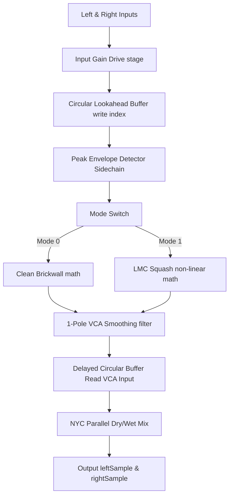

# DSP & Frontend Deep-Dive: Final Stage Limiter / LMC Module

This implementation note provides an excruciatingly detailed architectural, mathematical, and programmatic breakdown of the final processing stage of the **Mushin** hybrid synthesizer. It details the stereo lookahead peak limiting equations, the Listen Mic Compressor (LMC) emulation model, the C++ host telemetry thread mappings, and the dynamic HSL Web UI rendering system.

---

## 1. Mathematical & Algorithmic DSP Architecture

The C++ processing engine is housed inside `mushin::LimiterProcessor` (see [LimiterProcessor.h](file:///C:/Dev/github/philippeback/mushin/Source/dsp/LimiterProcessor.h)). It executes a series of sample-by-sample DSP calculations inside the stereo loop at Stage F of the audio thread.



### A. Stereo Circular Lookahead Delay Line
To guarantee absolute, zero-overshoot peak protection, the limiter must "peek" at upcoming audio transients before they physically arrive at the VCA (Voltage Controlled Amplifier) stage. This is achieved by delaying the processed signal by exactly $2.0\text{ ms}$, while feeding the *undelayed* signal to the peak detector sidechain.

1. **Buffer Allocation**:
   At a given sample rate $f_s$ (e.g. $44.1\text{ kHz}$ or $96.0\text{ kHz}$), the delay length in samples $N$ is calculated as:
   $$N = \text{clamp}\left( \lfloor 0.002 \cdot f_s \rfloor, 1, 256 \right)$$
   For $48.0\text{ kHz}$ audio, the circular delay line allocates exactly $97$ samples (including the guard sample).

2. **Circular Lookup Math**:
   On every sample step $n$:
   - The undelayed input sample $x[n]$ is written to the buffer at the current write pointer index $w$:
     $$D[w] = x[n]$$
   - The lookahead-delayed signal $x_d[n]$ is fetched exactly $1$ sample ahead of the write pointer, which corresponds to the oldest sample stored in the circular buffer:
     $$r = (w + 1) \pmod N$$
     $$x_d[n] = D[r]$$
   - The write pointer is advanced:
     $$w \leftarrow (w + 1) \pmod N$$

---

### B. Instant-Attack Sidechain Envelope Tracker
The sidechain tracks the peak envelope of the *undelayed* input signal. To ensure zero overshoot, the attack time is set to exactly $0.0\text{ ms}$ (instantaneous peak tracking), while the release phase decays exponentially according to the user's release time parameter.

1. **Release Time Coefficient**:
   The user's release parameter $T_{rel}$ (ranging from $10.0\text{ ms}$ to $1000.0\text{ ms}$) is converted into a sample-rate dependent decay coefficient $\alpha$:
   $$\tau = \frac{\max(T_{rel}, 10.0)}{1000.0} \quad (\text{seconds})$$
   $$\alpha = e^{-\frac{1}{f_s \cdot \tau}}$$

2. **Non-linear Envelope Update Equations**:
   For each channel, the envelope tracker compares the absolute value of the undelayed input $|x[n]|$ with the previous envelope state $E[n-1]$:
   $$E[n] = \begin{cases} 
      |x[n]| & \text{if } |x[n]| > E[n-1] \quad (\text{Instant Attack}) \\
      |x[n]| + \alpha \cdot (E[n-1] - |x[n]|) & \text{if } |x[n]| \le E[n-1] \quad (\text{Exponential Release})
   \end{cases}$$

3. **Subnormal Noise Protection**:
   To prevent CPU-intensive subnormal float calculations (underflow states where values crawl close to absolute zero), the envelope is clamped to exactly zero when it decays below a threshold:
   $$\text{if } E[n] < 10^{-6} \text{ then } E[n] \leftarrow 0.0$$

---

### C. Dual-Mode Gain Reduction Transfer Functions

Once the sidechain peak envelope $E[n]$ is tracked, the processor computes the raw target gain $g_{target}[n]$ based on the active mode:

#### Mode 0: Clean (Safety Brickwall) Mode
This mode behaves as a true peak-limiter. If the peak envelope exceeds the output ceiling gain $C$ (where $C = 10^{\frac{C_{dB}}{20}}$), the gain is scaled down perfectly to align the output peak with the ceiling; otherwise, gain remains at unity ($1.0$):
$$g_{target}[n] = \begin{cases}
   1.0 & \text{if } E[n] \le C \\
   \frac{C}{E[n]} & \text{if } E[n] > C
\end{cases}$$

#### Mode 1: LMC (Listen Mic Compressor) Vibe Mode
This mode emulates the legendary Solid State Logic (SSL) Listen Mic Compressor talkback circuit. It utilizes a fixed, extremely high compression ratio ($20:1$) with an aggressive soft-knee response calculated entirely in the decibel domain:

1. Convert envelope to decibels:
   $$E_{dB}[n] = 20 \log_{10}(E[n])$$
2. Calculate the overshoot amount above the ceiling threshold $C_{dB}$ (ranging from $-12.0\text{ dB}$ to $0.0\text{ dB}$):
   $$\Delta_{dB}[n] = E_{dB}[n] - C_{dB}$$
3. If overshoot is positive, compress the signal at a $20:1$ ratio:
   $$\text{if } \Delta_{dB}[n] > 0 \text{ then } G_{compressed, dB}[n] = C_{dB} + \frac{\Delta_{dB}[n]}{20.0}$$
4. Calculate the linear target gain ratio:
   $$g_{target}[n] = \frac{10^{\frac{G_{compressed, dB}[n]}{20.0}}}{E[n]}$$

---

### D. 1-Pole VCA Gain Smoothing & Parallel Mixing

1. **VCA Smoothing Filter**:
   Applying the raw $g_{target}[n]$ directly to the audio signal would cause clicking and popping artifacts due to instant steps. A 1-pole lowpass filter smooths the VCA gain transitions:
   $$g_{smoothed}[n] = g_{smoothed}[n-1] + \beta \cdot (g_{target}[n] - g_{smoothed}[n-1])$$
   Here, $\beta$ is set to a highly responsive coefficient of $0.25$, which yields instantaneous compression control while filtering out high-frequency modulation noise.

2. **NYC Parallel Dry/Wet Mix**:
   The final output sample combines the delayed dry path $x_d[n]$ and the wet gain-reduced path $x_{wet}[n] = x_d[n] \cdot g_{smoothed}[n]$ using a linear crossfade value $M$ (ranging from $0.0$ to $1.0$):
   $$y[n] = (1.0 - M) \cdot x_d[n] + M \cdot \left( x_d[n] \cdot g_{smoothed}[n] \right)$$

---

## 2. C++ Host Pipeline Integration

The host plugin integrates the limiter processor seamlessly inside [PluginProcessor.cpp](file:///C:/Dev/github/philippeback/mushin/Source/PluginProcessor.cpp) and [PluginEditor.cpp](file:///C:/Dev/github/philippeback/mushin/Source/PluginEditor.cpp).

### A. Raw APVTS Parameters & Ranges
The 6 parameters are declared and added to the `juce::AudioProcessorValueTreeState` layout:
```cpp
// Registered inside createParameterLayout()
layout.add (std::make_unique<juce::AudioParameterBool> (
    juce::ParameterID { "limiter_active", 1 }, "Limiter Active", false));
layout.add (std::make_unique<juce::AudioParameterChoice> (
    juce::ParameterID { "limiter_mode", 1 }, "Limiter Mode", juce::StringArray {"Clean", "LMC"}, 0));
layout.add (std::make_unique<juce::AudioParameterFloat> (
    juce::ParameterID { "limiter_drive", 1 }, "Limiter Drive", 0.0f, 24.0f, 0.0f));
layout.add (std::make_unique<juce::AudioParameterFloat> (
    juce::ParameterID { "limiter_ceiling", 1 }, "Limit Ceiling", -12.0f, 0.0f, -0.1f));
layout.add (std::make_unique<juce::AudioParameterFloat> (
    juce::ParameterID { "limiter_release", 1 }, "Limit Release", 10.0f, 1000.0f, 100.0f));
layout.add (std::make_unique<juce::AudioParameterFloat> (
    juce::ParameterID { "limiter_mix", 1 }, "Limiter Mix", 0.0f, 1.0f, 1.0f));
```

### B. Linear Smoother RAMPS
To prevent clicks during DAW parameter sweeps or automation, `PluginProcessor` uses four `juce::LinearSmoothedValue<float>` objects set to a $50\text{ ms}$ ramp time:
```cpp
smoothedLimiterDrive.reset (sampleRate, 0.05);
smoothedLimiterCeiling.reset (sampleRate, 0.05);
smoothedLimiterRelease.reset (sampleRate, 0.05);
smoothedLimiterMix.reset (sampleRate, 0.05);
```

### C. Audio Processing (Stage F Placement)
The processing happens inside the `processBlock` sample loop. It runs **after** the oscillators, filters, envelope generators, waveshapers, and the delay line (Stage D.8) have completed their work. Placing it at the absolute end of the pipeline ensures that no downstream module can cause digital clipping or peak exceeding.
```cpp
// --- STAGE F: Final Limiter (outside channel loop, inside sample loop, post-delay) ---
if (limiterActive && totalNumOutputChannels >= 2)
{
    limiterProcessor.processSample (leftSample, rightSample, 
                                   currentLimiterDrive, 
                                   currentLimiterCeiling, 
                                   currentLimiterRelease, 
                                   currentLimiterMix, 
                                   limiterModeVal);
}
```

### D. High-Frequency Telemetry Pipeline
1. **Atomic Min Tracking**:
   At the end of each `processBlock`, the audio thread extracts the current linear gain reduction value from the left and right DSP channels, tracks the maximum attenuation (the lowest gain multiplier), and writes it to a thread-safe atomic variable:
   ```cpp
   if (limiterActive && totalNumOutputChannels >= 2) {
       float grL = limiterProcessor.getGainReduction (0);
       float grR = limiterProcessor.getGainReduction (1);
       limiterGainReduction.store (std::min (grL, grR));
   } else {
       limiterGainReduction.store (1.0f); // Bypassed
   }
   ```
2. **30Hz Timer Event Dispatch**:
   Inside `Source/PluginEditor.cpp`, the editor running on the Message Thread reads the atomic variable at a $30\text{ Hz}$ frequency (every $33\text{ ms}$) and dispatches the raw telemetry data as a high-speed event to the Microsoft Edge/WebView2 JS engine:
   ```cpp
   void MushinAudioProcessorEditor::timerCallback()
   {
       // ... other visualizers ...
       if (auto* webComponent = getWebComponent()) {
           webComponent->emitEventIfBrowserIsVisible ("limiterGR", (double)audioProcessor.limiterGainReduction.load());
       }
   }
   ```

---

## 3. Web UI Subsystem Architecture & Bindings

The user interface for the Limiter resides in `Source/Web/index.html` alongside the rest of the synth layout.

```
+-------------------------------------------------+
| LIMITER                             [  ] Power  |
|                                                 |
|  ( Drive )  ( Ceiling )  ( Release )  ( Mix )   | [ LED LADDER ]
|   0.0 dB     -0.1 dB      100 ms       100%     | [ - 24 dB ] (Red)
|                                                 | [ - 12 dB ] (Orange)
| +---------------------------------------------+ | [ - 4 dB  ] (Cyan)
| | Mode:                              [ CLEAN ] | | [ - 1 dB  ] (Cyan)
| +---------------------------------------------+ | [ 0.0 dB  ] Readout
+-------------------------------------------------+
```

### A. Dynamic LED Ladder Decibel Math
The JS frontend receives the C++ event `'limiterGR'`, which provides a linear multiplier value $g \in [0.0, 1.0]$. The frontend converts this value to positive decibels of attenuation:

```javascript
function updateLimiterGRMeter(gr) {
    let grDb = 0.0;
    if (gr < 0.999 && gr > 0.0) {
        grDb = -20 * Math.log10(gr);
    }
    grDb = Math.max(0.0, grDb); // Clamp to positive numbers

    // Render text readout
    const textVal = document.getElementById('gr-text-val');
    if (textVal) {
        textVal.textContent = grDb.toFixed(1);
    }

    // Dynamic LED illumination
    const leds = document.querySelectorAll('.limiter-gr-ladder .gr-led');
    leds.forEach(led => {
        const thresholdDb = parseFloat(led.getAttribute('data-db'));
        if (grDb >= thresholdDb) {
            led.style.background = led.getAttribute('data-active-color');
            led.style.boxShadow = led.getAttribute('data-glow');
        } else {
            led.style.background = '';
            led.style.boxShadow = '';
        }
    });
}
```

### B. HSL Theme Curated LED segments
The vertical 10-segment LED ladder is styled using HSL-tailored glow variables:
- **Segments 1 to 4 ($1\text{ dB}$, $2\text{ dB}$, $3\text{ dB}$, $4\text{ dB}$)**: Glow in cyan (`rgba(0, 240, 255, 0.9)`) representing gentle, transparent leveling.
- **Segments 5 to 7 ($6\text{ dB}$, $9\text{ dB}$, $12\text{ dB}$)**: Glow in warm orange (`rgba(255, 170, 0, 0.9)`) showing moderate, audible squeezing.
- **Segments 8 to 10 ($15\text{ dB}$, $18\text{ dB}$, $24\text{ dB}$)**: Glow in vibrant red (`rgba(255, 80, 80, 0.9)`) warning of intense, saturated vintage squashing.

### C. Parameter Initialization and Seeding
To align the custom 270° Moog-style pointer sweeps on plugin load, the hidden range inputs use default values scaled perfectly to represent C++ defaults:
- **Drive**: $0.0\text{ dB}$ default $\rightarrow$ `data-default="0.0"`
- **Ceiling**: $-0.1\text{ dB}$ default $\rightarrow$ `data-default="0.9917"`
  $$\text{Scaled Value} = \frac{-0.1 - (-12.0)}{0.0 - (-12.0)} = \frac{11.9}{12.0} \approx 0.9917$$
- **Release**: $100\text{ ms}$ default $\rightarrow$ `data-default="0.0909"`
  $$\text{Scaled Value} = \frac{100.0 - 10.0}{1000.0 - 10.0} = \frac{90.0}{990.0} \approx 0.0909$$
- **Mix**: $100\%$ default $\rightarrow$ `data-default="1.0"`

---

## 4. MSVC Compiler Warning Resolutions

To achieve a 100% warning-free build under Debug and Release profiles, several strict C++ warnings were resolved:

### Warning C4244: Double-to-Float Implicit Promotion
- **The Issue**: `sampleRate` inside `PluginProcessor` is stored as a double-precision float (`double`). In the envelope decay equation:
  ```cpp
  float releaseCoef = std::exp (-1.0f / (sampleRate * releaseSec));
  ```
  `sampleRate * releaseSec` promoted the entire denominator to a `double`, causing MSVC to issue warning C4244 due to implicit narrowing down to `float releaseCoef`.
- **The Fix**: Cast the double-precision `sampleRate` explicitly inside the expression:
  ```cpp
  float releaseCoef = std::exp (-1.0f / (static_cast<float> (sampleRate) * releaseSec));
  ```

### Warning C4267: size_t to int Narrowing Warning
- **The Issue**: Assigning the size of a standard vector buffer directly to an integer:
  ```cpp
  int delayLength = delayLine.size();
  ```
  `delayLine.size()` returns a `size_t` (64-bit unsigned integer on modern platforms), causing compiler warnings when narrowed into a 32-bit `int` variable.
- **The Fix**: Apply an explicit `static_cast` to guarantee safe integer representation:
  ```cpp
  int delayLength = static_cast<int> (delayLine.size());
  ```
