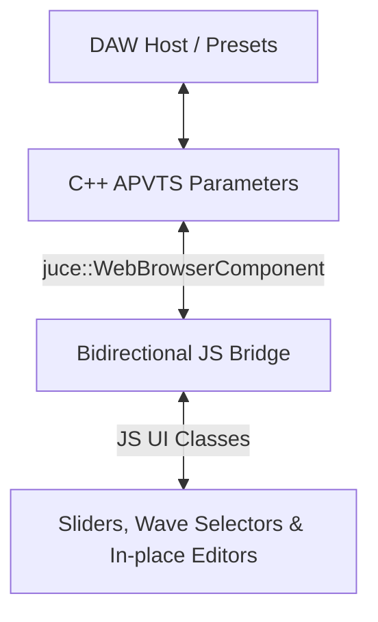

# Technical Implementation Specification: Musical LFO Sliders & Wave Shape Selector

This document specifies the technical design, UI patterns, and bidirectional communication bridge details for the Musical LFO Sliders and Wave Shape Selector controls in Mushin.

---

## 1. Feature Architecture Overview

The LFO controls utilize a hybrid C++/Web architecture. High-performance C++ DSP parameters are mapped via the **JUCE AudioProcessorValueTreeState (APVTS)**. The user interface runs within a `juce::WebBrowserComponent` (Microsoft Edge/WebView2 on Windows). Communication between the C++ host/preset manager and the JS frontend is fully bidirectional and normalized.



---

## 2. DSP Parameter Configuration & Mapping

LFO 1 and 2 frequency parameters are configured in C++ (`Source/PluginProcessor.cpp`) with a non-linear normalisable range and skew factor.

### C++ Normalisable Range Definition:
```cpp
params.push_back (std::make_unique<juce::AudioParameterFloat> (
    juce::ParameterID { "lfo1_freq", 1 }, "LFO 1 Freq", 
    juce::NormalisableRange<float>(0.1f, 20.0f, 0.0f, 0.4f), 1.0f));
```

### Mathematical Mapping Functions:
To ensure the web sliders visually sync and correspond exactly with the DSP, the frontend uses matching forward and inverse equations:

1. **Forward Mapping (Normalized to Real Hz Value):**
   $$realVal = min + (max - min) \cdot normVal^{1/skew}$$
   $$realVal = 0.1 + 19.9 \cdot normVal^{2.5}$$
   *This non-linear curve increases resolution at lower frequencies (e.g., 0.1Hz to 5.0Hz), which is critical for musical low-frequency modulation.*

2. **Inverse Mapping (Real Hz Value to Normalized [0..1] Slider Position):**
   $$normVal = \left(\frac{realVal - min}{max - min}\right)^{skew}$$
   $$normVal = \left(\frac{realVal - 0.1}{19.9}\right)^{0.4}$$
   *Used to convert keyboard numeric text inputs back to normalized positions for the range slider.*

---

## 3. Frontend Controls Implementation

### A. Tactile Precision Sliders (`MushinSlider`)
The `MushinSlider` class wraps default HTML5 range inputs (`lfo1_freq` and `lfo2_freq`) to bypass standard linear dragging, implementing advanced pointer and scroll interactions:
- **Interactive Dragging**: Listens to horizontal mouse (`mousedown`/`mousemove`) and touch events. Bounding client width is calculated dynamically to ensure correct tracking across resizable window dimensions.
- **Precision Mode**: Pressing the `Shift` key scales the horizontal movement delta by `0.15` (approximately a 6.6x reduction in sensitivity) to facilitate micro-tuning.
- **Mouse Wheel Scroll**: Supports mouse wheel scrolling over the slider track.
  - Normal step size: `0.02`
  - Precision Shift step size: `0.005`
- **Keyboard Navigation**: Arrow keys adjust the normalized value by `0.01` (or `0.002` when holding `Shift`).

### B. Clickable In-Place Numeric Value Inputs
Frequency displays (`#lfo1_freq-val`, `#lfo2_freq-val`) support in-place textual input:
- **Interaction Style**: Hovering changes the cursor to a pointer and brightens the display.
- **Editing Mode**: Clicking the display text transforms it into an `<input type="number" step="0.01">` box, pre-focused with all text pre-selected.
- **Commit & Clamp**: Pressing `Enter` or clicking outside (`blur` event) parses the text, clamps the value between `0.1` and `20.0` Hz, calculates the inverse skew value, and calls the JS-to-C++ update method.
- **Cancel Mode**: Pressing `Escape` discards changes and reverts to the original display text.

### C. Premium Vector SVG Waveshape Selectors
The standard choice `<select>` dropdown menu is replaced by custom horizontal rows of 5 interactive vector SVG buttons:

| Shape | Visual Representation | SVG Path (`viewBox="0 0 18 9"`) |
| :--- | :--- | :--- |
| **Sine** | Smooth quadratic curve | `M 1 4.5 Q 5 0.5 9 4.5 T 17 4.5` |
| **Triangle** | Symmetrical triangle | `M 1 4.5 L 5 1.5 L 13 7.5 L 17 4.5` |
| **Sawtooth** | Rising ramp saw | `M 1 7.5 L 13 1.5 L 13 7.5 L 17 5.5` |
| **Square** | Symmetrical step pulse | `M 1 4.5 L 5 4.5 L 5 1.5 L 13 1.5 L 13 7.5 L 17 7.5` |
| **Random** | Stepped sample & hold noise | `M 1 4.5 L 5 4.5 L 5 7.5 L 9 7.5 L 9 1.5 L 13 1.5 L 13 5.5 L 17 5.5` |

- **Active Styling**: Selected wave shapes are applied with the active theme color, custom borders, and a premium drop shadow filter:
  `filter: drop-shadow(0 0 2px var(--primary));`

---

## 4. JS-C++ Bidirectional Communication Bridge

To prevent communication desynchronization on choice parameters, all Web-to-C++ and C++-to-Web interactions utilize standardized normalized float values between `0.0` and `1.0`.

### A. C++ to Web Update Flow (`setParameterValue`)
When loading a preset or automating via host, the C++ editor receives a parameter update and calls the global JS callback:
```javascript
window.setParameterValue = (id, normVal) => {
    const config = params[id]; if (!config) return;
    const el = document.getElementById(id); if(!el) return;
    
    if (config.type === 'bool') {
        el.checked = normVal > 0.5;
    } else if (config.type === 'choice') {
        let numChoices = el.tagName === 'SELECT' ? el.options.length : 5;
        const choiceIndex = Math.round(normVal * (numChoices - 1));
        el.value = choiceIndex;
    } else {
        el.value = normVal;
    }
    
    updateParam(id, normVal, true); // true = skipNative callback loop
    ...
};
```

### B. Web to C++ Update Flow (`updateParam`)
Triggered from JS mouse drags, mouse wheel, text commits, or SVG button clicks.
```javascript
function updateParam(id, normVal, skipNative = false) {
    const config = params[id]; if(!config) return;
    let realVal;
    if (config.type === 'bool') {
        realVal = normVal;
    } else if (config.type === 'choice') {
        let numChoices = (id === 'lfo1_wave' || id === 'lfo2_wave') ? 5 : 2;
        realVal = Math.round(normVal * (numChoices - 1));
    } else if (config.skew) {
        realVal = config.min + (config.max - config.min) * Math.pow(normVal, 1/config.skew);
    } else {
        realVal = config.min + (config.max - config.min) * normVal;
    }
    
    const valEl = document.getElementById(id + '-val');
    if(valEl) valEl.textContent = config.display(realVal);

    // Sync HTML5 Slider visual fill
    const el = document.getElementById(id);
    if (el && el.tagName === 'INPUT' && el.type === 'range') {
        el.style.setProperty('--track-fill', (normVal * 100) + '%');
    }

    // Sync SVG Wave Selector button states
    if (id === 'lfo1_wave' || id === 'lfo2_wave') {
        syncWaveSelectorUI(id, normVal);
    }

    if (!skipNative) {
        if (backend && backend.setParameterValue) backend.setParameterValue(id, normVal);
        window.location.href = "mushin://setParameterValue?id=" + id + "&val=" + normVal;
    }
}
```

---

## 5. Verification Plan

### Automated Compilation:
Compile the web frontend assets and package the JUCE project using the CMake generator target:
```powershell
cmake --build build2 --config Debug
```

### Visual and Functional Checkout Checklist:
1. **LFO Range Verification**: Check that both frequency labels display a maximum value of `20.00Hz` (linear config updated from the outdated `50.0Hz` range).
2. **Text Input Editing**: Click `#lfo1_freq-val`, type `4.56`, and hit Enter. The slider and display must update. Re-click, type `-1.5`, and hit Enter; the input must clamp to `0.10Hz`.
3. **Tactile Drag Interception**: Click and drag LFO freq sliders horizontal tracks. Hold `Shift` while dragging; the adjustment speed must slow down by 85%.
4. **Mouse Wheel Verification**: Hover the mouse over the LFO frequency slider and scroll the wheel; the value must change step-wise. Hold `Shift` to scroll with micro-tuning resolution.
5. **Bidirectional State Sync**: Save a preset with "Saw" waveshape active, load another preset with "Square" active, and re-load the first preset. The active waveshape highlights must toggle between Saw and Square correctly.
