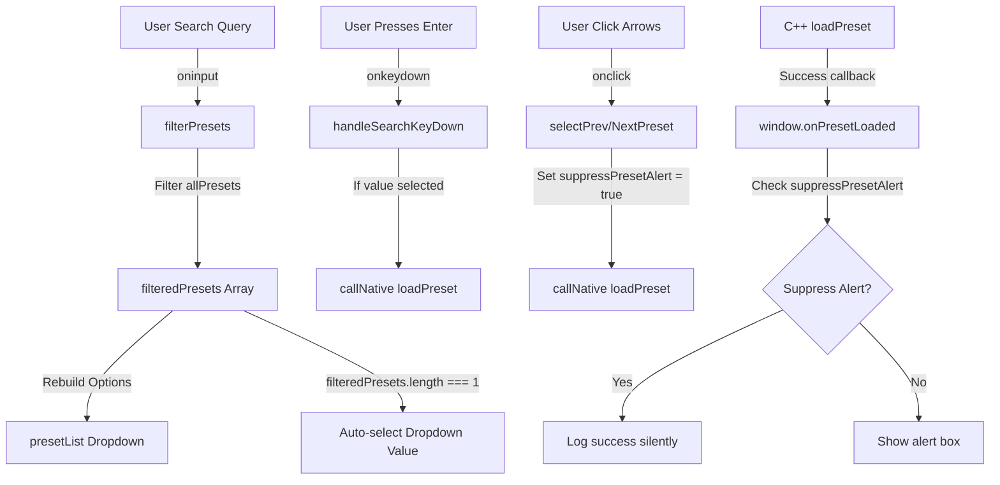

# Preset Switcher & Search Filter – Technical Specification
**Location:** `doc/features_implementation/implementation_preset_switcher.md`

---

## 1. Overview

The **Preset Switcher and Search Filter** enhancements optimize the preset management interface of the Mushin plugin. They empower the user to quickly navigate and find presets via live search and tactile direction arrows, allowing frictionless sound auditioning.

### Feature Deliverables:
1. **Live Search Filter**: Dynamically narrows down the preset list in the dropdown as the user types.
2. **Auto-Select Single Match**: Automatically focuses and selects the matching preset when the list filters down to exactly one element.
3. **Tactile Cycling Arrows**: Flanking buttons (`◀` and `▶`) to step backwards and forwards through the filtered list.
4. **Round-Robin Wrapping**: Cycles back to the beginning when reaching the end of the list (and vice-versa).
5. **Smart Auditioning (Silent Cycle Alert)**: Suppresses distracting native browser `alert("Preset Loaded")` popup dialogs during arrow cycles, while preserving them for explicit dropdown and button loads.
6. **Enter Key Activation**: Pressing `Enter` while focused inside the search field instantly loads the currently active single match preset.
7. **Startup Theme Dropdown Sync**: Syncs the initial visual theme loaded by the C++ backend on startup with the selected name in the frontend theme list dropdown.

---

## 2. Technical Architecture

The Preset Switcher utilizes the pre-existing native bridge methods in the C++ `PresetManager` and `PluginEditor.cpp`. The core layout and logic are fully implemented in the frontend (`Source/Web/index.html`).



### State Variables:
- `let allPresets = []`: Caches the complete, unfiltered array of presets returned by the C++ `PresetManager::getPresetList()`.
- `let filteredPresets = []`: Holds the active subset of presets matching the search query.
- `let suppressPresetAlert = false`: A transient boolean flag that prevents native blocking popups during fast cycling.

---

## 3. UI Styling & Layout

The UI components are styled to match the dark, hardware-oriented "Signal Corruptor" aesthetic.

### 1. HTML Layout
The `.preset-area` container inside `Source/Web/index.html` was restructured as follows:

```html
<div class="preset-area">
    <!-- Theme Selector Dropdown -->
    <select id="themeList" class="preset-select" onchange="setTheme(this.value)" style="width:100px;">
        <option value="Industrial">Industrial</option>
        <option value="Synthwave">Synthwave</option>
        <option value="Acid">Acid</option>
        <option value="Firepits">Firepits</option>
        <option value="Ocean Deep">Ocean Deep</option>
        <option value="Ice World">Ice World</option>
        <option value="Dark Hellish">Dark Hellish</option>
    </select>
    
    <!-- Dynamic Search Input -->
    <input type="text" id="presetSearch" class="preset-search" placeholder="Search..." oninput="filterPresets()" onkeydown="handleSearchKeyDown(event)">
    
    <!-- Previous Arrow Button -->
    <button id="btnPrevPreset" class="preset-btn arrow-btn" onclick="selectPrevPreset()">◀</button>
    
    <!-- Preset Selection Dropdown -->
    <select id="presetList" class="preset-select">
        <option value="">- SELECT PRESET -</option>
    </select>
    
    <!-- Next Arrow Button -->
    <button id="btnNextPreset" class="preset-btn arrow-btn" onclick="selectNextPreset()">▶</button>
    
    <!-- Action Buttons -->
    <button class="preset-btn" onclick="loadPreset()">Load</button>
    <button class="preset-btn" onclick="savePreset()">Save</button>
    <button class="preset-btn" onclick="deletePreset()">Del</button>
</div>
```

### 2. CSS Styles
The styling integrates high-end interactive glows in the primary theme color (`var(--primary)`) when interactive components are selected or focused:

```css
.preset-search {
    background: var(--display-bg);
    color: var(--primary);
    border: 1px solid var(--marking);
    font-size: 0.55rem;
    padding: 1px 4px;
    width: 70px;
    font-family: inherit;
    outline: none;
    box-sizing: border-box;
}

.preset-search:focus {
    border-color: var(--primary);
    box-shadow: 0 0 3px var(--primary);
}

.preset-search::placeholder {
    color: var(--text-main);
    opacity: 0.4;
}

.arrow-btn {
    padding: 2px 4px !important;
    font-size: 0.55rem !important;
    display: inline-flex;
    align-items: center;
    justify-content: center;
    width: 18px;
    height: 18px;
    box-sizing: border-box;
}
```

---

## 4. Javascript Frontend Logic

The Javascript functions added or modified to support this workflow include:

### 1. Dynamic Search Filter & Auto-Selection
This function triggers on every keypress in `#presetSearch`. It filters `allPresets` into `filteredPresets`, rebuilds the dropdown, and auto-selects if a single match exists:

```javascript
function filterPresets() {
    const searchInput = document.getElementById('presetSearch');
    const select = document.getElementById('presetList');
    if (!select) return;

    const query = searchInput ? searchInput.value.toLowerCase().trim() : '';

    // Filter matching presets
    filteredPresets = allPresets.filter(name => name.toLowerCase().includes(query));

    // Remember the selected value before rebuilding options
    const currentVal = select.value;

    // Rebuild the HTML <select> options
    select.innerHTML = '<option value="">- SELECT PRESET -</option>';
    filteredPresets.forEach(name => {
        const opt = document.createElement('option');
        opt.value = name;
        opt.textContent = name;
        select.appendChild(opt);
    });

    // Re-apply value or auto-select single match
    if (filteredPresets.includes(currentVal)) {
        select.value = currentVal;
    } else if (filteredPresets.length === 1) {
        // Automatically put it in the preset box
        select.value = filteredPresets[0];
    } else {
        select.value = '';
    }

    // Handle button disabling if zero matches found
    const leftArrow = document.getElementById('btnPrevPreset');
    const rightArrow = document.getElementById('btnNextPreset');
    if (leftArrow && rightArrow) {
        const disabled = filteredPresets.length === 0;
        leftArrow.disabled = disabled;
        rightArrow.disabled = disabled;
        leftArrow.style.opacity = disabled ? '0.3' : '1.0';
        rightArrow.style.opacity = disabled ? '0.3' : '1.0';
        leftArrow.style.cursor = disabled ? 'not-allowed' : 'pointer';
        rightArrow.style.cursor = disabled ? 'not-allowed' : 'pointer';
    }
}
```

### 2. Enter Key Quick Activation
Fires on the keydown event in the search box to load the single auto-selected preset:

```javascript
function handleSearchKeyDown(e) {
    if (e.key === 'Enter') {
        const select = document.getElementById('presetList');
        if (select && select.value) {
            suppressPresetAlert = false; // Enter activation displays success alert
            callNative("loadPreset", [select.value]);
        }
    }
}
```

### 3. Cycle Navigation & Round-Robin Wrapping
Steps backward and forward through `filteredPresets` and triggers a native call immediately with `suppressPresetAlert = true`:

```javascript
function selectPrevPreset() {
    if (filteredPresets.length === 0) return;
    const select = document.getElementById('presetList');
    if (!select) return;

    let currentIndex = filteredPresets.indexOf(select.value);
    let nextIndex;
    if (currentIndex === -1) {
        // Start wrapping at the last item
        nextIndex = filteredPresets.length - 1;
    } else {
        nextIndex = (currentIndex - 1 + filteredPresets.length) % filteredPresets.length;
    }

    const presetName = filteredPresets[nextIndex];
    select.value = presetName;
    suppressPresetAlert = true;
    callNative("loadPreset", [presetName]);
}

function selectNextPreset() {
    if (filteredPresets.length === 0) return;
    const select = document.getElementById('presetList');
    if (!select) return;

    let currentIndex = filteredPresets.indexOf(select.value);
    let nextIndex;
    if (currentIndex === -1) {
        // Start wrapping at the first item
        nextIndex = 0;
    } else {
        nextIndex = (currentIndex + 1) % filteredPresets.length;
    }

    const presetName = filteredPresets[nextIndex];
    select.value = presetName;
    suppressPresetAlert = true;
    callNative("loadPreset", [presetName]);
}
```

### 4. Alert Suppression Callbacks
Integrates the `suppressPresetAlert` mechanic into the bridge callbacks:

```javascript
window.onPresetLoaded = () => { 
    log("Preset Loaded Successfully"); 
    if (!suppressPresetAlert) {
        alert("Preset Loaded"); 
    }
    suppressPresetAlert = false; 
};

window.onPresetError = (msg) => { 
    log("Error: " + msg); 
    alert("Error: " + msg); 
    suppressPresetAlert = false;
};
```

---

## 5. Startup Theme Dropdown Synchronization

On initialization, the C++ editor loads the persistently stored skin from disk (`currentTheme = mushin::SkinStorage::getSavedSkinName()`). Once the WebView is ready, C++ triggers the following Javascript call:

```cpp
webComponent->evaluateJavascript("if (window.applyThemeFromNative) window.applyThemeFromNative('" + currentTheme + "');");
```

### Missing Frontend Link Resolved:
We implemented the `window.applyThemeFromNative` callback to capture this event on startup and synchronize the `#themeList` dropdown's selection state:

```javascript
window.applyThemeFromNative = (name) => {
    const select = document.getElementById('themeList');
    if (select) {
        select.value = name;
    }
};
```

---

## 6. Verification and Validation

### Automated Build Verification:
Compile using PowerShell CMake build target in MSVC Debug mode:
```powershell
cmake --build build2 --config Debug
```
Re-packages `Source/Web/index.html` assets into `BinaryData.cpp` and links the new binary layout cleanly.

### Standalone Validation:
1. Launch standalone application.
2. Verify visual theme loaded from disk matches the text displayed in the theme selector dropdown.
3. Verify Typing "Init" in the preset search box narrows the dropdown down to exactly one match, and hitting `Enter` immediately applies the preset parameters.
4. Verify clicking the `◀` and `▶` arrows cycles through the preset bank silently, immediately and fluidly adjusting the UI parameter layout with zero modal dialog interruptions.
