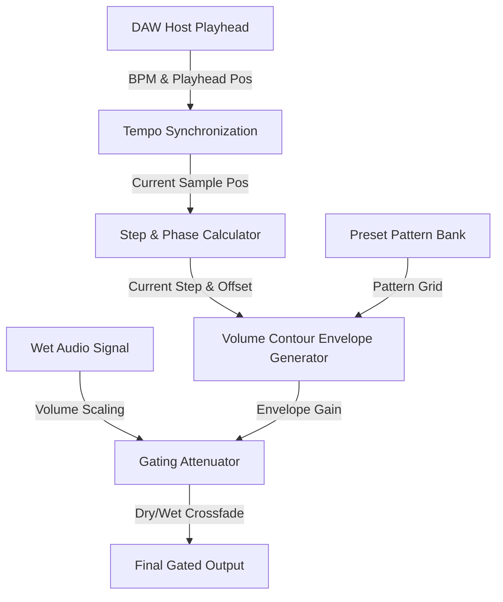

# Technical Implementation Specification: Tempo-Synced Trance Gate DSP & UI

**Location:** `doc/features_implementation/implementation_trance_gate.md`  
**Association:** `doc/features/feature_trancegating.md`  
**Date:** May 2026

---

## 1. Overview & Architecture

The **Trance Gate** is a pattern-based volume gating effect that applies a rhythmic volume envelope to the synthesizer's output. It synchronizes with the host's tempo (BPM) to create classic rhythmic "trance gating" effects.



---

## 2. DSP Engine Architecture

The Trance Gate processor will be implemented as a dedicated DSP utility in `Source/dsp/TranceGateProcessor.h`.

### 2.1 Pattern Bitmask Representation
To achieve maximum speed and zero memory overhead, the 16-step patterns are represented as a sequence of `uint16_t` bitmasks. Step 0 corresponds to the Least Significant Bit (LSB) and Step 15 to the Most Significant Bit (MSB).

```cpp
namespace mushin {
struct TranceGatePattern {
    juce::String name;
    uint16_t mask;
};

static const std::vector<TranceGatePattern> presetPatterns = {
    { "Straight 16th", 0xAAAA },     // 1010101010101010 (Alternate)
    { "Offbeat 16th",  0x5555 },     // 0101010101010101 (Offbeat)
    { "Classic 1",     0xEEEE },     // 1110111011101110 (Trance Classic A)
    { "Classic 2",     0x9999 },     // 1001100110011001 (Syncopated)
    { "Four-On-Floor", 0xF0F0 },     // 1111000011110000
    { "Galop",         0xD7D7 },     // 1101011111010111
    { "Space Gate",    0x8888 },     // 1000100010001000 (Staccato)
    { "Euclidean 5",   0x8912 }      // 1000100100010010
};
}
```

### 2.2 Tempo Synchronization & Playhead Phase
To ensure sample-accurate synchronization with the DAW grid, the processor retrieves the host playhead position in `processBlock`. 

#### Fallback Free-Running Clock:
If the DAW transport is stopped, or the playhead is unavailable (e.g., in standalone mode), the processor transitions smoothly to a **Free-Running Sample Counter** so the gate pattern remains active.

```cpp
double bpm = 120.0;
double playheadSamples = 0.0;
bool isPlaying = false;

if (auto* playHead = getPlayHead()) {
    if (auto posInfo = playHead->getPositionInfo()) {
        bpm = posInfo->getBpm().value_or(120.0);
        playheadSamples = (double)posInfo->getTimeInSamples().value_or(0);
        isPlaying = posInfo->getIsPlaying();
    }
}

// Track position phase
if (isPlaying) {
    currentSamplePosition = playheadSamples;
} else {
    // Advance internal clock
    currentSamplePosition += numSamplesProcessed;
}
```

### 2.3 Step & Offset Calculations
Given the current sample position $s_{pos}$, host BPM, and selected rate (1/16, 1/8, 1/4):

1. **Step Duration in Seconds** ($T_{step}$):
   - **Rate 1/16**: $T_{step} = \frac{60.0}{BPM \cdot 4}$
   - **Rate 1/8**: $T_{step} = \frac{60.0}{BPM \cdot 2}$
   - **Rate 1/4**: $T_{step} = \frac{60.0}{BPM}$

2. **Step Duration in Samples** ($S_{step}$):
   $$S_{step} = T_{step} \cdot \text{sampleRate}$$

3. **Current Cycle & Step Index**:
   - Total samples in a 16-step loop: $S_{cycle} = S_{step} \cdot 16$
   - Cycle-relative sample position: $s_{cycle} = \text{fmod}(s_{pos}, S_{cycle})$
   - Current Step Index (0 to 15): 
     $$\text{step} = \lfloor \frac{s_{cycle}}{S_{step}} \rfloor$$
   - Offset within current step: 
     $$s_{offset} = s_{cycle} - (\text{step} \cdot S_{step})$$

### 2.4 Volume Contour Envelope Generator
For the current step, we retrieve its active state from the selected pattern bitmask:
$$\text{isActive} = (\text{patternMask} \& (1 \ll \text{step})) \neq 0$$

If `isActive` is true, the gate opens and closes based on the **Start**, **Hold**, and **End** envelope parameters:

- **Start Duration** ($D_{start}$ in samples): $\text{startMs} \cdot 0.001 \cdot \text{sampleRate}$ (clamped to max 50% of $S_{step}$).
- **Hold Width** ($W_{gate}$ in samples): $S_{step} \cdot (\text{holdPercent} \cdot 0.01)$.
- **End Duration** ($D_{end}$ in samples): $\text{endMs} \cdot 0.001 \cdot \text{sampleRate}$ (clamped to max 50% of $S_{step}$).

#### Envelope Phase Logic:
Within a single step period $t = s_{offset}$:
1. **Gate Closed (Inactive Step)**:
   $$\text{env}(t) = 0.0$$
2. **Gate Active Step**:
   - If $t < D_{start}$ (Attack phase):
     $$\text{env}(t) = \frac{t}{D_{start}}$$
   - If $D_{start} \le t < (W_{gate} - D_{end})$ (Hold phase):
     $$\text{env}(t) = 1.0$$
   - If $(W_{gate} - D_{end}) \le t < W_{gate}$ (Decay/Release phase):
     $$\text{env}(t) = 1.0 - \frac{t - (W_{gate} - D_{end})}{D_{end}}$$
   - If $t \ge W_{gate}$:
     $$\text{env}(t) = 0.0$$

#### Gating Attenuation & Mix:
Applying Depth ($D_{depth}$ from 0.0 to 1.0) and Dry/Wet Mix ($M_{mix}$ from 0.0 to 1.0):
- **Base Attenuation Level** (completely closed state): $A_{base} = 1.0 - D_{depth}$.
- **Gated Gain**: $G_{gated} = A_{base} + (D_{depth} \cdot \text{env}(t))$.
- **Final Sample Gain**:
  $$\text{gain}(t) = (1.0 - M_{mix}) + (M_{mix} \cdot G_{gated})$$

---

## 3. APVTS Parameter Configuration

We will add the following parameters in `PluginProcessor.cpp` under `createParameterLayout()`:

| Parameter ID | Name | Type | Range / Options | Default |
| :--- | :--- | :--- | :--- | :--- |
| `tg_active` | Gate Active | Bool | [Off, On] | Off |
| `tg_mix` | Gate Mix | Float | `0.0f` to `1.0f` | `1.0f` *(100% Gated)* |
| `tg_pattern` | Gate Pattern | Choice | Preset Pattern List (0 to 7) | `0` *(Straight 16th)* |
| `tg_rate` | Gate Rate | Choice | `["1/16", "1/8", "1/4"]` | `0` *(1/16)* |
| `tg_start` | Gate Start (Atk) | Float | `0.0f` to `100.0f` ms | `5.0f` ms |
| `tg_hold` | Gate Hold (Width) | Float | `10.0f` to `100.0f` % | `50.0f` % |
| `tg_end` | Gate End (Decay) | Float | `0.0f` to `200.0f` ms | `10.0f` ms |
| `tg_depth` | Gate Depth | Float | `0.0f` to `100.0f` % | `100.0f` % |

---

## 4. Web UI Component Design

To deliver a premium hardware look and avoid cluttering Column 3, the Trance Gate UI is implemented as a **full-width bottom rack strip** located directly below the main feature grid.

### 4.1 UI Layout Structure (HTML)
```html
<!-- TRANCE GATE FULL-WIDTH STRIP -->
<div class="sub-panel" style="margin-top: 6px; display: flex; flex-direction: row; align-items: center; justify-content: space-between; gap: 15px; padding: 6px 16px; min-height: 75px; height: 75px; box-sizing: border-box; flex: 0 0 auto;">
    <!-- Left Side: Controls -->
    <div style="display: flex; align-items: center; gap: 10px; flex: 0 0 auto;">
        <div class="sub-panel-title" style="border-bottom: none; margin-bottom: 0; font-size: 0.9rem; text-align: left; margin-right: 6px;">TRANCE GATE</div>
        <div style="display: flex; align-items: center; gap: 4px;">
            <input type="checkbox" id="tg_active">
            <div class="label" style="font-size: 0.65rem;">Active</div>
        </div>
        <select id="tg_pattern" style="width: 120px; font-size: 0.6rem; padding: 2px;">
            <option value="0">Straight 16th</option>
            <option value="1">Offbeat 16th</option>
            <option value="2">Classic 1</option>
            ...
        </select>
        <select id="tg_rate" style="width: 55px; font-size: 0.6rem; padding: 2px;">
            <option value="0">1/16</option>
            <option value="1">1/8</option>
            <option value="2">1/4</option>
        </select>
    </div>

    <!-- Middle: 16-step LED indicators (centered) -->
    <div style="flex: 1; display: flex; justify-content: center; align-items: center;">
        <div class="tg-step-grid" id="tg_grid_container" style="width: 320px; margin-bottom: 0; padding: 3px;">
            <!-- 16 generated circles -->
        </div>
    </div>

    <!-- Right Side: 5 Knob Cluster -->
    <div style="display: flex; gap: 8px; flex: 0 0 auto; align-items: center;">
        <!-- Mix, Depth, Atk (Start), Hold (Width), Dec (End) Knobs -->
    </div>
</div>
```

### 4.2 Styling & Theming (CSS)
All colors reference the dynamically injected CSS custom variables to respect the 60/30/10 rule.

```css
/* Step Grid LEDs */
.tg-step-grid {
    display: grid;
    grid-template-columns: repeat(16, 1fr);
    gap: 2.5px;
    margin-bottom: 4px;
    padding: 3px;
    background: rgba(0, 0, 0, 0.25);
    border: 1px solid var(--marking);
    border-radius: 3px;
}

.tg-step-led {
    height: 9px;
    background: #0f0f0f;
    border: 1px solid rgba(255, 255, 255, 0.05);
    border-radius: 50%;
    box-shadow: inset 0 1.5px 3px rgba(0, 0, 0, 0.8), 0 1px 1px rgba(255, 255, 255, 0.03);
    transition: background 0.1s ease, box-shadow 0.1s ease;
}

.tg-step-led.active {
    background: #1a1a1a;
    border-color: rgba(255,255,255,0.08);
    box-shadow: inset 0 1.5px 3px rgba(0,0,0,0.8);
}

.tg-step-led.active-playhead {
    background: var(--primary) !important;
    box-shadow: 0 0 10px var(--primary), inset 0 1px 2px rgba(255, 255, 255, 0.5) !important;
    border-color: var(--primary) !important;
}
```

### 4.3 JavaScript Controller (UI Sync)
A high-frequency `tgStep` listener handles real-time playhead sweeping.

```javascript
// Sync active step glow sequence from C++ high-frequency dispatch
window.addEventListener("tgStep", (e) => {
    const activeStep = Math.round(e.detail);
    const leds = document.querySelectorAll(".tg-step-led");
    leds.forEach((led, idx) => {
        if (idx === activeStep) {
            led.classList.add("active-playhead");
        } else {
            led.classList.remove("active-playhead");
        }
    });
});
```

---

## 5. Implementation Roadmap (Status: Completed)

1. **DSP Integration [DONE]**: Created `TranceGateProcessor.h`. Connected inside serial DSP thread in `PluginProcessor::processBlock` between Stage D (Mix) and Stage E (Final Gain).
2. **APVTS & Host Sync [DONE]**: Registered 8 `tg_` parameters. Structured sample-accurate envelope calculations and fallback free-running counters.
3. **HTML/JS Layout [DONE]**: Implemented horizontal full-width bottom strip in `index.html`. Linked bidirectional bindings for choice arrays and knob components.
4. **Compile & Verification [DONE]**: Verified tempo sync playhead sweeps and dynamic HSL theming integrations.

---

## 6. Layout & UX Refinements

### 6.1 Layout Shift to Bottom Strip
Initially, the Trance Gate was slotted into Column 3. Due to vertical stacking heights (Sidechain, Noise, and Trance Gate in one column), controls were squeezed and clipped. Moving the Trance Gate to a dedicated full-width strip below the three-column `.feature-grid` optimized Column 3 vertical space and improved usability.

### 6.2 Editor Window Height Adjustments
To prevent overflowing viewport clipping, the C++ editor size dimensions in `PluginEditor.cpp` were scaled up:
- **Original**: `1200x600` (clipped bottom panels)
- **First Iteration**: `1200x680` (improved, but still caused clipping on some displays)
- **Final Design**: `1200x760` (provides ample space for the `.feature-grid` columns and the `75px` bottom Trance Gate strip to fit snugly and cleanly).

### 6.3 Preset UX Polish (Modal Alert Removal)
To ensure a modern, uninterrupted user workflow, modal alert popups upon successful preset operations were removed:
- Removed `alert("Preset Saved");` from `window.onPresetSaved`.
- Removed `alert("Preset Loaded");` from `window.onPresetLoaded`.
- Console logging is maintained for behind-the-scenes confirmation.
- Critical error alerts (`onPresetError`) remain intact to alert the user of file system issues.
