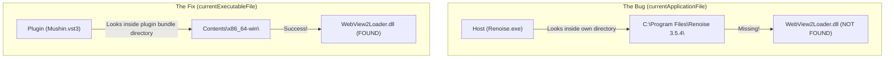

# Safe Plugin Initialization & Host-Unload Lifetime Guide

This document explains the technical root causes, mechanisms, and architectural solutions for the crashes and hangs resolved in **Mushin**. It is designed to be an easy-to-grok, headache-free guide for understanding the unique constraints of building hybrid C++/Web audio plugins (VST3) on Windows.

---

## Table of Contents
1. [Core Architectural Difference: Standalone EXE vs. VST3 DLL](#1-core-architectural-difference-standalone-exe-vs-vst-dll)
2. [The Microsoft WebView2 Loader & Kernel Locks](#2-the-microsoft-webview2-loader--kernel-locks)
3. [Component Lifetimes & SafePointer in Async Callbacks](#3-component-lifetimes--safepointer-in-async-callbacks)
4. [Process-Wide Logger Pointer Cleanup on DLL Unload](#4-process-wide-logger-pointer-cleanup-on-dll-unload)
5. [The Deployed VST3 Bundle Directory Anatomy](#5-the-deployed-vst3-bundle-directory-anatomy)

---

## 1. Core Architectural Difference: Standalone EXE vs. VST3 DLL

When you build a JUCE application, you generate different formats from the same codebase:
* **Standalone application (`.exe`):** A self-contained process.
* **VST3 plugin (`.vst3` / `.dll`):** A shared library loaded dynamically into a host process (e.g., `Renoise.exe`, `Ableton.exe`).

### The Bug: File Location Lookup
Inside the `MushinAudioProcessorEditor` constructor, we tell the plugin where to find `WebView2Loader.dll` (which Microsoft WebView2 needs to render our HTML/JS UI). 

Initially, the code resolved the path like this:
```cpp
auto dllFile = juce::File::getSpecialLocation(juce::File::currentApplicationFile)
                   .getSiblingFile("WebView2Loader.dll");
```

### Why This Crashed:
* **In Standalone Mode:** `currentApplicationFile` returns the path to `Mushin.exe`. It looks in the folder containing `Mushin.exe`, finds `WebView2Loader.dll`, and works perfectly.
* **In VST3 Mode:** `currentApplicationFile` returns the path to the **host application process** (e.g., `C:\Program Files\Renoise 3.5.4\Renoise.exe`). The plugin therefore looks for `WebView2Loader.dll` inside the **Renoise folder**, where it does not exist!



### The Solution:
Change the location lookup to `currentExecutableFile`. 
* **In Standalone Mode:** Returns `Mushin.exe`.
* **In VST3 Mode:** Returns the actual plugin DLL binary (`Mushin.vst3/Contents/x86_64-win/Mushin.vst3`).

```cpp
auto dllFile = juce::File::getSpecialLocation(juce::File::currentExecutableFile)
                   .getSiblingFile("WebView2Loader.dll");
```
Now, the plugin searches for the DLL inside its own bundle directory, independent of whatever DAW/host is running it.

---

## 2. The Microsoft WebView2 Loader & Kernel Locks

When Microsoft's WebView2 library fails to find its helper loader DLL (`WebView2Loader.dll`), it doesn't throw a clean C++ exception. Instead, it enters an unstable state:
1. The loader thread hangs or experiences an access violation.
2. The DAW's GUI thread blocks waiting for the webview window to report that it initialized.
3. This creates a deadlock. The host process (`Renoise.exe`) becomes unresponsive.

### Why the file became locked and unkillable:
When Windows threads hang during low-level DLL loading, they can enter an **Uninterruptible Sleep State (D-state)** inside the Windows kernel.
* Standard user-space commands like `taskkill /F` or PowerShell's `Stop-Process -Force` only tell the kernel to terminate the process's user-mode threads.
* If a thread is stuck inside a kernel-level lock (e.g., file-system or device-driver lock), the OS kernel refuses to kill the process to avoid corrupting filesystem tables.
* The only way to release this lock and overwrite the locked plugin binary is to **reboot the computer**.

> [!IMPORTANT]
> **Takeaway:** Never let third-party loaders fail silently during constructor initialization, and always package dependencies (`WebView2Loader.dll`) directly inside the VST3 bundle folders.

---

## 3. Component Lifetimes & SafePointer in Async Callbacks

Because WebView2 initialization takes time, JUCE uses a **deferred initialization timer** (set to 250 milliseconds) to spin up the web view. 

### The Bug: Dangling `this` Captures
Initially, asynchronous callbacks and timers were set up using standard lambda captures capturing the raw `this` pointer:

```cpp
juce::MessageManager::callAsync([this] {
    if (webComponent) // CRASH here if the editor was closed!
        webComponent->evaluateJavascript("...");
});
```

### Why it crashed:
Audio plugin editors are created and destroyed constantly. 
1. If a producer opens the plugin GUI in their DAW, the editor is constructed, starting a deferred timer.
2. If they close the plugin GUI immediately (before the 250ms timer fires), the host deletes the editor object (`MushinAudioProcessorEditor`).
3. When the timer eventually fires, it attempts to execute the lambda using the raw `this` pointer. Since `this` has been deleted, it points to freed memory, causing an **Access Violation / Segmentation Fault**.

### The Solution:
Use `juce::Component::SafePointer` (which acts like a weak reference for UI components).
* A `SafePointer` keeps track of whether the component it points to is still alive.
* If the editor is deleted, the `SafePointer` automatically resets its inner pointer to `nullptr`.

```cpp
// Create a safe weak pointer copy of "this"
juce::Component::SafePointer<MushinAudioProcessorEditor> safeEditor(this);

juce::MessageManager::callAsync([safeEditor] {
    // Check if the editor is still alive before dereferencing it!
    if (safeEditor != nullptr && safeEditor->webComponent)
        safeEditor->webComponent->evaluateJavascript("...");
});
```
If the user closes the plugin UI before the message is executed, `safeEditor` evaluates to `nullptr` and the callback bails out safely instead of crashing the DAW.

---

## 4. Process-Wide Logger Pointer Cleanup on DLL Unload

JUCE provides a global logging utility accessed via `juce::Logger::writeToLog(...)`. 

### The Bug: Dangling Logger Pointer
To aid in diagnostics, we set a custom file logger:
```cpp
// Constructor
juce::Logger::setCurrentLogger(new juce::FileLogger(logFile, "Mushin Log Started", 0));
```

### Why it crashed on unload:
1. When a DAW scans a plugin or when you remove a plugin from a track, the DAW unloads the plugin's DLL from memory.
2. In the initial code, the plugin processor destructor (`~MushinAudioProcessor`) did not clean up the global logger pointer.
3. The global pointer `juce::Logger::currentLogger` remained pointing to the memory address of our `FileLogger` object.
4. However, that memory was just freed because the plugin DLL was unloaded.
5. The next time the DAW tries to write to its log or unloads other components, it dereferences the stale `currentLogger` pointer, crashing the DAW on exit.

### The Solution:
Manage the logger with a `std::unique_ptr` and explicitly reset the global logger pointer to `nullptr` during destruction if it points to our logger.

```cpp
// In destructor (~MushinAudioProcessor)
MushinAudioProcessor::~MushinAudioProcessor()
{
    // If the global logger is ours, set it back to nullptr before we disappear
    if (juce::Logger::getCurrentLogger() == fileLogger.get())
        juce::Logger::setCurrentLogger(nullptr);
}
```

---

## 5. The Deployed VST3 Bundle Directory Anatomy

A VST3 plugin on Windows is not just a single `.vst3` file. Under the VST3 specification, it is structured as a **bundle folder** containing the binary, resource assets, and companion libraries.

Here is what the deployed directory structure must look like for Mushin to initialize successfully on Windows:

```text
C:\Program Files\Common Files\VST3\
└── Mushin.vst3\                      <-- VST3 Bundle Folder
    └── Contents\
        ├── Resources\
        │   └── moduleinfo.json       <-- Metadata for VST3 validation
        └── x86_64-win\
            ├── Mushin.vst3           <-- The actual plugin DLL binary (renamed to .vst3)
            └── WebView2Loader.dll    <-- MUST be located next to the binary!
```

Our deployment script `deploy.ps1` automates this layout:
1. It copies `WebView2Loader.dll` from the standalone output directory into the local bundle's `Contents\x86_64-win\` subfolder.
2. It recursive-copies the entire `Mushin.vst3\` folder to the global Windows VST3 directory.
