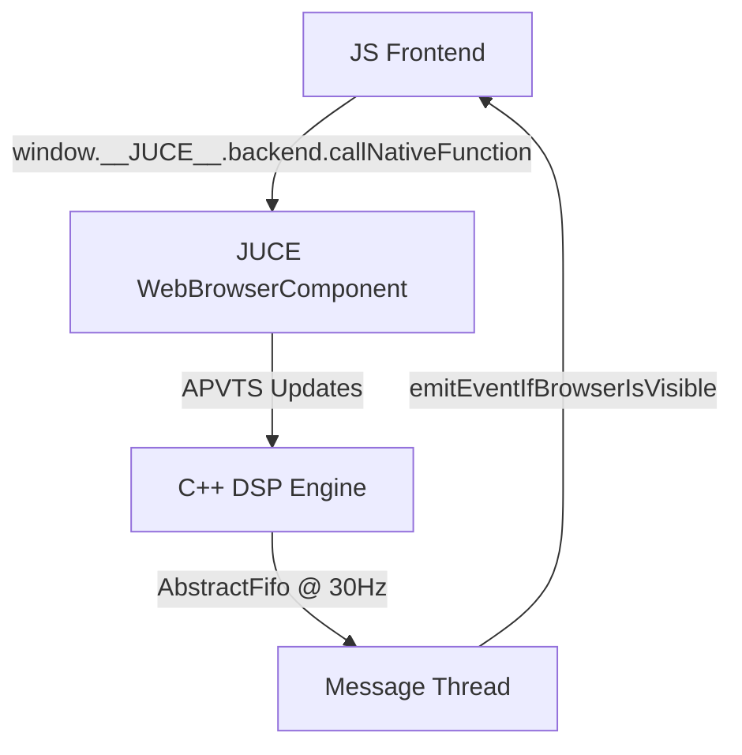

# The Chronicles of Mushin: A Journey of DSP and Web Architecture

This document chronicles the engineering journey of **Mushin**, a hybrid audio plugin translating the mathematical dynamics of market physics into digital signal processing. Written as an epic chronicle of our development milestones, it documents the design moves, challenges overcome, and technical triumphs that led to the current architecture.

---

## Prologue: The Vision of Mushin

The core philosophy of Mushin is unique: it translates market physics and statistical trading logic directly into high-fidelity audio signal processing. Instead of automating a traditional user interface, we sought to build a system where the audio waveform decays, saturates, filters, and fragments in real-time based on principles resembling momentum, exhaustion, and decay:
* **Drive & Saturation:** Information saturation represented by a soft-clipping hyperbolic tangent curve.
* **Exhaustion Events:** The absolute exhaustion of dynamic range, shifting soft saturation into brutal hard clipping.
* **The Kinetic Choke:** Low-pass filter modulation driven by the interplay of Potential Energy (Slow Momentum) and Kinetic Energy (Fast Momentum).
* **The Air Gap:** Circular delay buffers pausing time to freeze audio into static granular drones during trend uncertainty.
* **Information Decay:** Bitcrushing and quantization error representing signal degradation as confidence drains.

---

## Chapter I: The Foundations of the Bridge

Our first major hurdle was establishing a robust, low-latency communication layer between our two primary architectures:
1. **The C++ Audio Engine:** Powered by **JUCE 8.0.4** and its high-performance DSP library.
2. **The Web Frontend:** Built with vanilla HTML5, CSS3, and modern ES6 JavaScript for a high-fidelity, highly interactive hardware-style layout.

We chose a hybrid web-bridge model utilizing Microsoft's **WebView2** (Edge/Chromium) backend on Windows. We implemented a custom `WebBrowserComponent` to intercept communication:
* **JS-to-C++ Parameter Pipe:** Interactive elements (knobs, sliders, toggles) invoke `window.__JUCE__.backend.callNativeFunction` to push instant, sample-accurate parameter modifications into the `AudioProcessorValueTreeState` (APVTS).
* **C++-to-JS Real-Time Telemetry:** For the high-frequency oscilloscope, we avoided heavy JSON polling. Instead, we built a high-speed `AbstractFifo` queue that gathers processed audio samples on the real-time processing thread, delivers them to the Message Thread, and pushes them to the WebView at **30Hz** using `emitEventIfBrowserIsVisible`. This ensures a buttery-smooth 60fps canvas rendering of the mono-summed signal without choking the audio callback.

---

## Chapter II: The Voice of the Machine

With the bridge built, we laid down the foundational DSP blocks inside `Source/dsp/`:
* **The S-Curve Waveshaper:** We implemented a customizable waveshaping processor with **Drive** (input saturation [1.0 to 10.0]) and **Threshold** (sensitivity [0.0 to 1.0]).
* **Hyperbolic Tangent Soft Saturation:** The normal operating curve of our shaper uses the classic $y = \tanh(x \cdot \text{drive})$ algorithm, delivering warm, analog-like even and odd harmonics.
* **The Exhaustion Switch:** When the `Exhaustion` parameter is toggled, the processor bypasses the soft-clipping curve and switches to a brutal hard-clip threshold. Any amplitude exceeding the threshold is abruptly squared off, mimicking the complete saturation of information in a crashing system.
* **Auto-Gain Compensation:** To protect ears and speakers from massive spikes in volume when Drive is maxed, we engineered an automatic gain correction layer that balances the RMS output.

---

## Chapter III: State, Persistence, and Aesthetics

An epic journey is nothing without aesthetic style and memory. We turned our attention to presets, settings storage, and layout design.

### The XML Preset System
We designed a dedicated `PresetManager` in C++ that interfaces directly with our APVTS. It serializes the entire plugin state into clean XML documents, storing them in `%APPDATA%\Mushin\Presets`.
* Features full **CRUD operations** (Create, Read, Update, Delete) exposed directly to the web UI.
* In a critical UX pass, we removed intrusive load/save alert popups, replacing them with fluid, unobtrusive state changes in the UI.
* Added a search filter bar inside the UI header so producers can easily filter through banks of user presets.

### Dynamic Theme Persistence
To make Mushin customizable, we implemented a custom theme architecture. The user can switch skins on the fly, with styles loaded from dynamically served CSS files:
* We implemented `mushin::SkinStorage` to persist the selected skin across plugin instances. It writes configuration data to a lightweight INI file located at `%APPDATA%\MushinPlugin\settings.ini`.
* On reload, the plugin immediately recalls the user's preferred skin. We debugged and resolved a key edge-case where the visual look of the dropdown indicator was not matching the loaded skin, achieving seamless persistence.
* **The 60/30/10 Design Rule:** The visual interfaces were designed using harmonious dark aesthetics: 60% dominant background gray, 30% panel and border structures, and 10% high-contrast cyan accents (`#00d2ff`) for interactive elements, custom SVGs, and the live waveform.

---

## Chapter IV: The Kinetic Choke and the Rhythms of Time

As the plugin matured, we introduced complex modulation and rhythmic motion.

### The Dual Filter & LFO Modulation Matrix
To map Potential vs. Kinetic energy, we implemented a **Dual Filter** system (`Filter A` and `Filter B`) operating in Serie, Parallel, or Split modes:
* Custom State-Variable Biquads supporting Low-Pass, High-Pass, Band-Pass, and Notch filtering, equipped with dynamic Resonance ($Q$), analog Grit, and Drive controls.
* We paired this with a **sample-accurate LFO Modulation Matrix** mapping two separate Low-Frequency Oscillators to filter parameters.
* *The UI Rescue:* During early matrix testing, a bug occurred where the matrix layout was missing LFO2's resonance (B-Res) slider. We successfully tracked it down and restored the missing parameter, fully exposing the dual-filter matrix capabilities.
* *LFO Ergonomics:* The LFO speed ranges were originally hard to control at low speeds. We refined the taper math, allowing producers to make precise adjustments in micro-ranges (e.g., 0.1Hz, 0.2Hz to 1.0Hz) while still allowing sweepable high rates.

### The Tempo-Synced Trance Gate
To slice the signal rhythmically, we built a step-sequencer-based **Trance Gate**:
* Powered by a 16-step sequencer synced directly to the DAW host's tempo and time signature.
* To accommodate the step grid beautifully, we redesigned the web editor's geometry: moving the trance gate to a full-width bottom strip and expanding the editor height to **760px** for a gorgeous, responsive workspace.

---

## Chapter V: Degradation, Space, and Textures

We expanded Mushin's sonic capabilities with an array of secondary digital algorithms:
1. **Quantization Error Processor:** An emulated bitcrusher that represents information decay. It dynamically scales down processing resolution from 24-bit down to a crunchy 4-bit, injecting pleasant digital noise.
2. **Stereo Ping-Pong Delay:** A spatial processor featuring discrete left/right delay times, feedback control, and high/low damping filters to simulate sonic space.
3. **Envelope Follower & Sidechain:** Features full sidechain routing and envelope tracking. We routed a silent test signal into the sidechain to verify the dynamic ducking algorithm, allowing the incoming sidechain level to modulate parameters like Drive or Gain.
4. **Noise Oscillator:** A dedicated white/pink noise generator running in the DSP pipeline to blend analog texture and grit into the dry signal.

---

## Chapter VI: The Safety Net and Deployment Automation

As a professional-grade audio plugin, safety and deployment packaging were critical:
* **The Peak Limiter:** To act as a final guard against digital clipping, we integrated a brickwall Limiter Processor at the very end of our C++ signal chain, complete with gain reduction telemetry pushed back to the UI meter.
* **The Automated Installer (`rebuild_installer.ps1`):** To ease compilation on Windows, we wrote a PowerShell automation script that coordinates:
  * Running **CMake** to generate and compile optimized Debug/Release binaries in the `build2` folder using MSBuild.
  * Collecting the compiled Standalone and VST3 formats.
  * Ensuring the vital `WebView2Loader.dll` dependency is bundled next to the binaries.
  * Launching **Inno Setup** compiler via CLI to generate a seamless `.exe` windows installer.

---

## Epilogue: The State of Mushin

Today, **Mushin** stands as a robust, fully compiled JUCE 8 VST3 and Standalone plugin. The hybrid combination of highly optimized C++ DSP modules and an ultra-premium, dark-mode web user interface provides the best of both worlds:
1. Pure, hardware-accelerated DSP processing unaffected by UI thread delays.
2. A beautiful, resizable, high-DPI responsive web dashboard that makes manipulating complex modulation, saturation, presets, and sequencing an absolute joy.

The tribulations were many—from debugging web-bridge asynchronous calls and fixing missing biquad controls to perfecting persistent ini settings—but the result is a masterpiece of hybrid plugin engineering.
